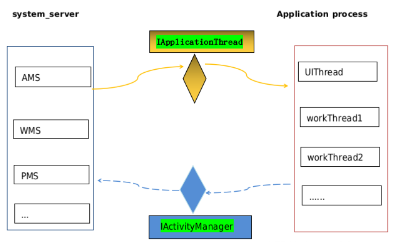

# App启动流程

## Android基础理论

1. 每一个Android App都运行在一个单独的进程中;

2. Android App由很多不同组件组成，这些组件还可以启动其他App的组件
3.  一个进程里面只有一个主线程
4. 进程在其需要的时候被启动;

## Android启动流程

1. bootloader启动内核和init进程
2. init进程产生守护进程-daemons;
3. init进程启动Zygote进程
4. Zygote进程初始化第一个VM,预加载framework和通用资源
5. init进程启动runtime进程;
6. Zygote进程孵化出System Server;

## App启动模式

### 冷启动	

 当App启动时，后台没有该App的进程，这时系统会创建一个新的进程分配给该应用， 这个启动方式就叫做冷启动（后台不存在该应用进程）。冷启动因为系统会重新创建一个新的进程分配给它，所以会先创建和初始化Application类，再创建和初始化MainActivity类（包括一系列的测量、布局、绘制），最后显示在界面上。

### 热启动

> 热启动只执行了冷启动的第二阶段

当App已经被打开，按下返回/Home/切换到其他App,再重新切回这个App时，这种方式叫做热启动(后台存在这个App的进程)

热启动因为会从已有的进程中来启动，所以热启动就不会走创建/初始化Application这步了，而是直接走MainActivity（包括一系列的测量、布局、绘制），即Application只会初始化⼀次。

热启动时，系统将 activity 带回前台。如果应用程序的所有 activity 存在内存中，那么应用程序可以避免重复对象初始化、渲染、绘制操作。

和冷启动的区别： **不需要创建 Application**。

无论是冷启动还是热启动，都要重新上电，检测硬件，将RAM区清零，即所有变量都初始化为0。

### 温启动

- 用户连续按返回键退出了应用，然后重新启动。进程可能还没有被杀死，但应用必须通过调用onCreate（）重新创建 Activity。
- 系统回收了应用的内存，然后用户重新运行应用。应用进程和Activity都需要重新启动

##  创建应用进程

**`Android`系统中一般应用进程的创建都是统一由`zygote`进程`fork`创建的，`AMS`在需要创建应用进程时，会通过`socket`连接并通知到到`zygote`进程在开机阶段就创建好的`socket`服务端，然后由`zygote`进程`fork`创建出应用进程。**整体架构如下图所示：

## App启动流程(冷启动)

### 关键角色

1. Zygote进程： Android系统启动过程中会先启动init进程。然后init进程通过解析init.rc文件fork生成Zygote进程，init进程也是Android系统的首个Java进程，init进程的PID是1。之后Zygote进程负责孵化System Server进程和APP进程。

2. SystemServer进程： 由Zygote进程fork生成，SystemServer是Zygote孵化的第一个进程。负责启动、管理整个Java Framework，系统里面重要的服务都是在这个进程里面开启的，比如**AMS**(ActivityManagerService)、**PMS**(PackageManagerService)、**WMS**(WindowManagerService)

3. APP进程： Zygote进程在App层中孵化出的第一个进程是Launcher进程，即手机的桌面APP。Zygote还会孵化出Browser、Email、Phone等APP进程，每个APP至少运行在一个进程上。所有APP进程都由Zygote进程fork生成。

4. Android系统里的Client/Server模式： 平时我们所熟知的前端（Web\Android\iOS）通过网络与服务器通信是客户端-服务端模式的体现，而在Android Framework中，四大组件的创建、生命周期也是通过这样的模式进行通信。

   服务器端(server)：指的就是SystemServer进程，这个进程提供了很多服务，比如AMS、PMS、WMS等等，所有的APP进程都可以与其通信。

   客户端(client)：指的就是各个独立的APP进程。

Binder机制

在Android系统中，一个进程的空间，分为**用户空间**和内核空间两部分。一个进程内的用户空间和内核空间可以进行数据交互。多个进程间的用户空间是隔离开来的，只有内核空间能进行数据交互。[Binder机制](Android/Binder%E6%9C%BA%E5%88%B6.md)可以实现内核间的数据交互。

Android为应用进程与系统进程建立在Binder之上通信的业务逻辑设计了两个Binder接口，用作交互使用。

 **IApplicationThread:** 作为系统进程请求应用进程的接口。

 **IActivityManager:** 作为应用进程请求系统进程的接口

> APP进程与SystemServer进程通过Binder机制，进行跨进程通信
>
> SystemServer进程与Zygote进程通过Socket，进行跨进程通信

### App启动流程图

### 冷启动步骤

1. 启动APP进程： 当我们点击Launcher桌面程序的APP图标时，Launcher程序会调用startActivity()函数，通过Binder跨进程通信，发送消息给system_server进程。在system_server进程中，由AMS通过socket通信告知Zygote进程fork出一个子进程(APP进程)。
2. 开启APP主线程： APP进程启动后，会实例化一个ActivityThread，并执行其main函数，同时会创建ApplicationThread、Looper、Handler对象，开启主线程消息循环Looper.loop()。
3. 创建并初始化Application和Activity： ActivityThread的main函数通过调用attach方法进行 Binder 通信，通知system_server进程执行AMS的attachApplication方法。在attachApplication方法中，AMS分别通过bindApplication、scheduleLaunchActivity方法，通知APP进程的主线程Handler，对APP进程的Application和Activity进行初始化，并执行Application、Activity的生命周期。
4. UI布局和绘制： 主线程Handler初始化Activity时，会执行创建PhoneWindow、初始化DecorView的操作，并且添加布局到DecorView的ContentView中。ContentView，对应着Activity的setContentView中设置的layout.xml布局文件所在的最外层父布局。

## App启动时Application和Activity的生命周期调用

1、Application 构造方法
2、attachBaseContext();
3、onCreate();
4、MainActivity的对象构造
5、MainActivity的onCreate0);
6、MainActivity的onStart0)
7、MainActivity的onResume0);
8、MainActivity的onAttachToWindow0;
9、MainActivity的onWindowFocusChanged0:

