# Perfetoo 教程

> 导入文件
>
> 1.导入systrace.html
>
> 2.导入atrace `python systrace.py --from-file xxx.atrace`将atrace转为html（在systrace.py文件目录中进入）
>
> 
>
> 3.导入atrace：使用BandZip解压atrace

## 1、如何查看唤醒线程端：

在systrace上,我们一般是通过查看Runnable状态中的wakeup from,然后自己滑到对应的线程区域。

Perfetto的操作方式不同,我们只需要点击Runnable后的Running状态,然后点击下方的跳转按钮；


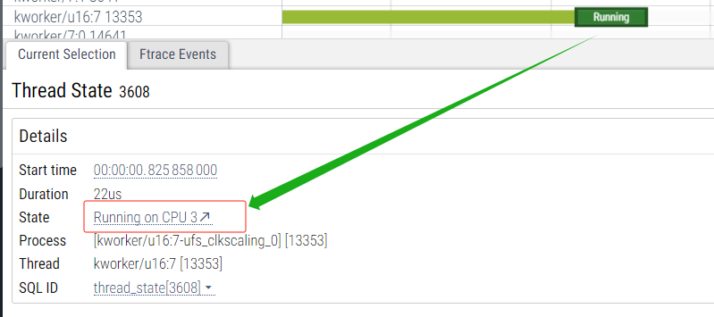

选中唤醒端线程对应的slice,然后同样点击跳转按钮，即可跳转回对应的进程区域的轨道中；

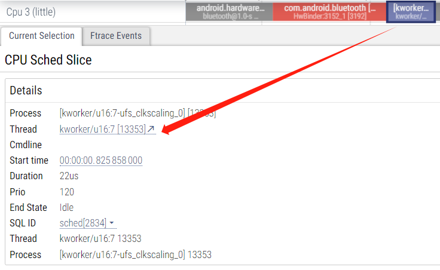


## 3、常规分析

### a. 图例指标

`slice` (片段，选中片段后会显示黑色边框)，对应代码中`Trace.beginSection/ATRACE_BEGIN`记录的事件。

`counter` (计数器，离散的数值点) 代码中`Trace.traceCounter/ATRACE_INT`记录的事件。

`sched/freq` (`CPU`调度、频率)

`thread_state` (线程状态)：点击片段上方线程调度信息片段(`Running`)，可以看到线程当前运行在哪个`CPU`上。

### b.锁竞争(lock contention)

看到`lock contention`片段，可以点击上边的`monitor contention`来查看当前对象锁竞争发生的调用栈，如下详情中显示当前对象锁被`Owner InputDispatcher（56)`持有，其持锁当前运行在`MessageQueue.enqueueMessage(MessageQueue.java:557行) `，且当前等待该对象锁的线程有0个；当前线程执行被阻塞在`.MessageQueue.next()`方法中(`MessageQueue.java:337行`)。


### c.添加标记

Perfetoo提供两种标记类型,标记的方式分别为:

1.  点击最上方的时间轨道即可添加时间点标记.

2. 而通过按住鼠标左键选中一块区域然后点击"shift+m"即可添加常驻区域标记

   如果只是点击"m"添加的是临时区域标记,当再次选中另外一块区域添加临时区域时,上一个临时区域会自动移除.

通过选中已经添加的标记,我们可以选择为其添加标记名,或者更改其颜色,以及执行移除操作。


### d.选中框的含义

当我们选中一段时间内的几个线程时，还需要加入其他线程。就可以通过选择复选框，来添加需要分析的线程或进程。然后整体查看这些线程的运行信息


## 4、SQL查询与展现

搜索框输入英文冒号`:`，即可开启`SQL`输入，可以使用`SQL`来查询并定位具体的`trace`片段（`slice`）。

输入`SQL`语句，`Enter`，得到查询结果，显示在底部表格中，点击表格中的每一行，可以跳转到具体的`slice`中，根据`trace`上下文可以进一步分析问题。


>当你查询slice时发现缺少一些需要的上下文信息,此时请通过track_id去JOIN查询对应的上下文: 例如你想知道你查询的slice其属于哪个线程,此时你就可以通过JOIN thread_track找到线程的utid,然后通过utid JOIN到thread表中找到这条线程的详细信息.
>utid 对应 thread表,upid 对应 process表.

- slice：(片段，选中片段后会显示黑色边框)，对应代码中`Trace.beginSection/ATRACE_BEGIN`记录的事件
- counter：`counter` (计数器，离散的数值点) 代码中`Trace.traceCounter/ATRACE_INT`记录的事件。
- sched： CPU调度信息就查询这张表,但是这张表只包含Running的任务.其他状态需要自己结合end_state和ts计算或者直接用下面的表
- thread_state：点击片段上方线程调度信息片段(`Running`)，可以看到线程当前运行在哪个`CPU`上。记录线程的完整状态,相当于扩展了的sched表


此处列出几个常用的Table/View的格式及关键字段信息 

slice表，横向track上的一条条小片段

ts：片段起始时间戳(单位ns)

dur:片段持续时长(ns)

track_id属于哪个track(水平timeline)

name: 片段标注的名称,对应Trace中打印的方法名、标记等信息


thread_track表，utid标识线程tid，并不是真实的线程tid

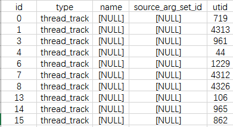

thread表,表示各线程信息，其中utid和thread_track表的utid关联

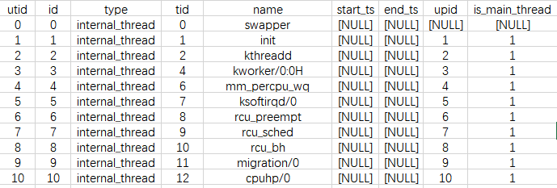

process表，upid和thread表的upid关联，表示线程所属的父进程


sched_slice，线程调度片段

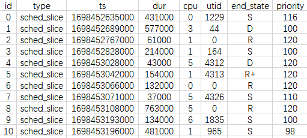

thread_state，各track上边的线程调度片段，标识线程运行状态

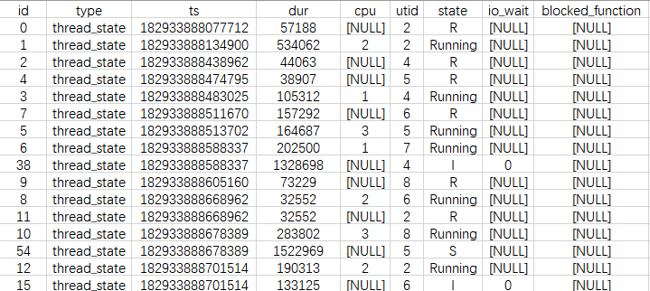


常用SQL查询

```sql
# 1. 列出所有doFrame片段,按耗时倒序排列，取前100条
select  slice_id,track_id,ts,dur,dur/1e6,name from slice WHERE name like '%doFrame%'  order by dur desc limit 100

# 2. 1查询的基础上，指定process name为systemui，即systemui自身的绘帧信息
select  slice_id,track_id,ts,dur,dur/1e6,slice.name from slice JOIN thread_track ON  slice.track_id = thread_track.id JOIN thread USING(utid) JOIN process  USING(upid) WHERE process.name = 'com.android.systemui' and slice.name like  '%doFrame%' order by dur desc limit 100

# 3. system_server中各OPF:关键字片段的耗时信息，包含各片段的真实running_time(每个slice可能有一段时间running，一段时间sleep，一段时间runnable，需要借助thread_state表来查询slice中各调度时间片的状态)
select  slice_id,track_id,thread.utid,slice.ts,slice.dur,(slice.dur/1e6) as dur_ms,  (select total(case when thread_state.ts < slice.ts then  MIN(slice.ts+slice.dur,thread_state.ts+thread_state.dur)-slice.ts when  (thread_state.ts+thread_state.dur) > (slice.ts+slice.dur) then  (slice.ts+slice.dur-MAX(thread_state.ts,slice.ts)) else thread_state.dur end)  from thread_state where thread_state.utid=thread.utid and  thread_state.state='Running' and thread_state.ts < (slice.ts+slice.dur)  and (thread_state.ts+thread_state.dur) > slice.ts)/1e6 as  total_running,slice.name from slice JOIN thread_track ON slice.track_id =  thread_track.id JOIN thread USING(utid) JOIN process USING(upid) WHERE  process.name='system_server' and slice.name like 'OPF:%' order by slice.dur  desc limit 400

# 4.system_server中的锁竞争情况(lockcontention)，lock_depth表示当时参与此对象锁竞争的线程个数
select  count(1) as lock_depth, s.slice_id,s.track_id,s.ts,s.dur,s.dur/1e6 as  dur_ms,ctn.otid,s.name
from  slice s, (select slice_id,track_id,ts,dur,name,substr(name, 46,  instr(name,')')-46) as otid
from  slice t
WHERE  name like 'Lock contention on a monitor lock %'
order  by dur) ctn
JOIN  thread_track ON s.track_id=thread_track.id JOIN thread USING(utid) JOIN  process USING(upid)
WHERE
    process.name = 'system_server'
and  s.name like 'Lock contention on a monitor lock %'
    and substr(s.name, 46,  instr(s.name,')')-46) = ctn.otid
    and ctn.slice_id <> s.slice_id
    and ctn.ts >= s.ts and  (ctn.ts+ctn.dur) <= (s.ts+s.dur)
group  by s.slice_id
order  by s.dur desc
```


## 5、实战分析

### 5.1.卡顿丢帧

分析HomePageActivity丢帧问题

#### 1、定位app在perfetoo中位置

| 1. App 的主线程和渲染线程 找到每一帧耗时的部分               |  |
| ------------------------------------------------------------ | ------------------------------------------------------------ |
| 2.超过一个 Vsync 周期的 doFrame 耗时，需要去看一下是否真的发生的掉帧，就算没有掉帧，也要看一下原因 | 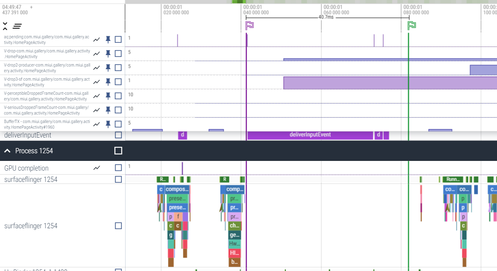 |

#### 2、分析 SurfaceFlinger 进程的主线程和 Binder 线程

#### 

| 1. 由于多个 Buffer 缓冲机制存在，App 主线程和渲染线程，有时候即使超过一个 Vsync 周期，也不一定会出现卡顿，所以这里我们需要看SurfaceFlinger 进程的主线程，来确认是否真的发生了卡顿 | 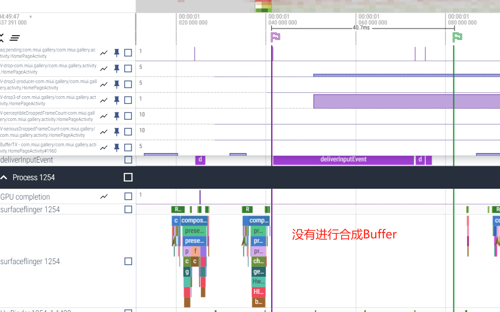 |
| ------------------------------------------------------------ | ------------------------------------------------------------ |
| 2.查看对应app的surfaceFlinger 对应的Buffer个数               |  |

### 3、分析耗时任务

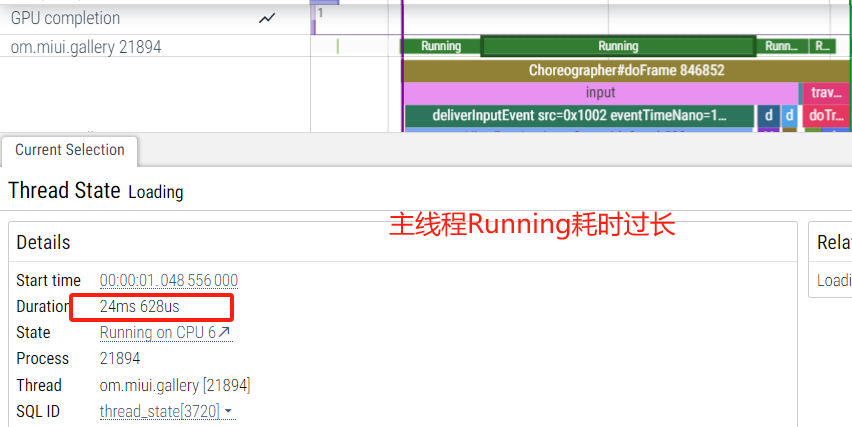

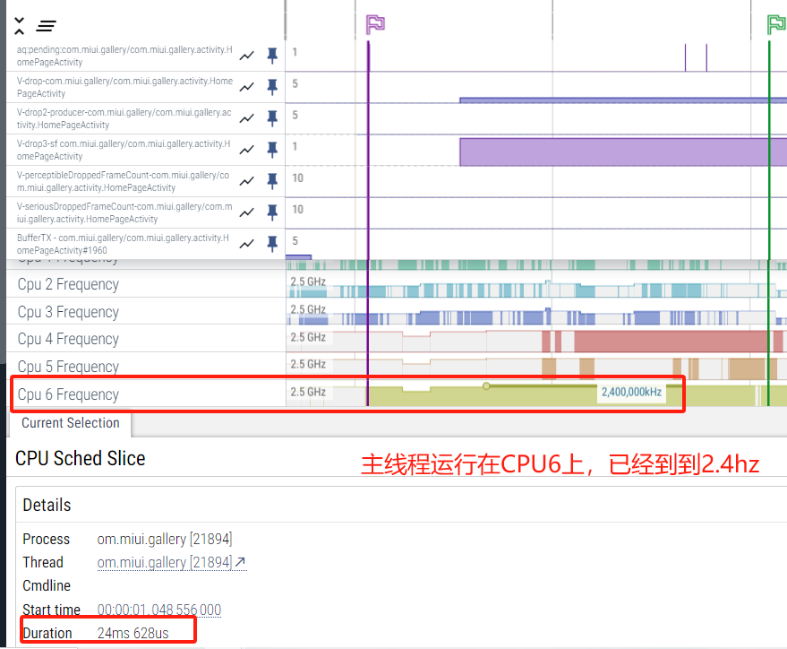、


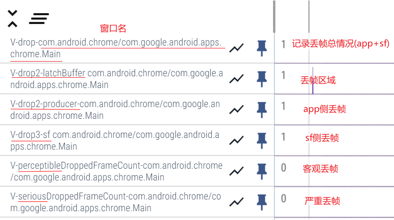


