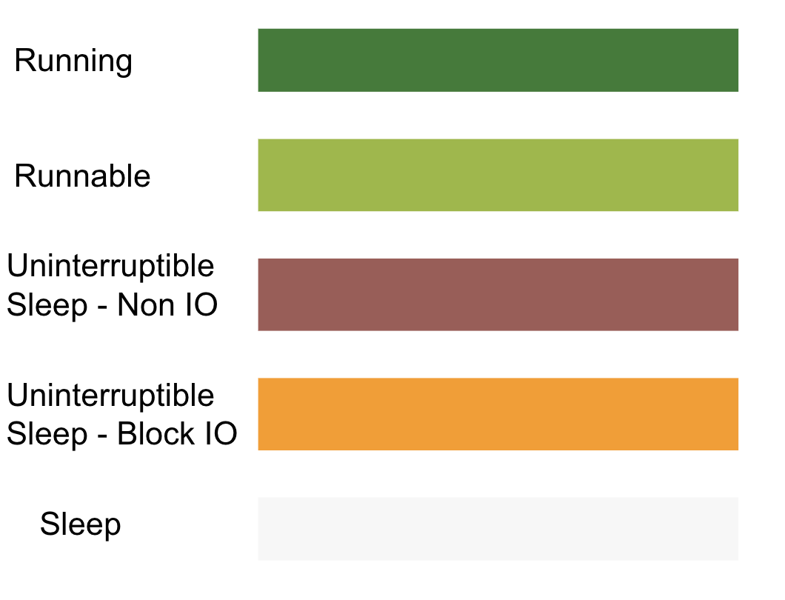
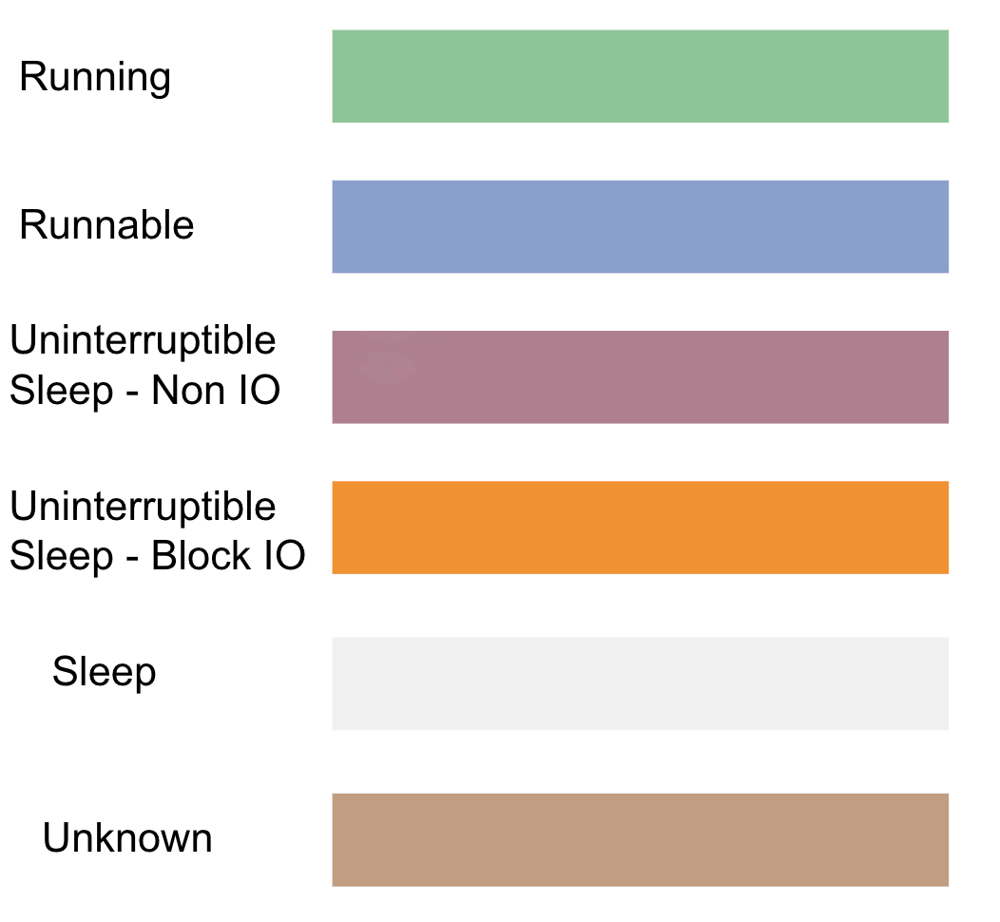
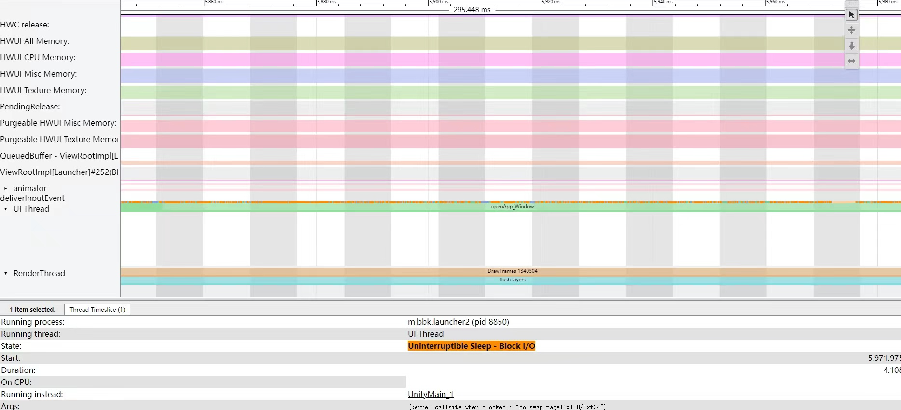

# CPU运行状态分析

## CPU运行状态Runnable分析

### Runnable状态说明

一个CPU核 在 某一时刻只能执行一个线程，所有等待执行的任务都在[可执行队列]中排队。

能进入[可执行队列]的任务，代表这些任务除了CPU资源，其他资源均已获取，比如IO、锁、信号量...

处于可执行队列时，线程的状态就会变为Runnable

Linux内核通过赋予不同的线程时间片通过轮转的方式来达到同时执行多个线程的效果，因此当一个Running中的线程时间片用完时将该线程设置为Runnable，等待下一次调度。有些高优先级的线程可以抢占当前执行的线程，不必等当前Running的线程时间片到期

多核CPU通过Linux调度器来实现任务线程在核上的迁移，具体通过多个调度类(Schedule Class)来管理不同线程的优先级

>1. SCHED_RR、SCHED_FIFO: 实时调度类，整体优先级上高于 NORMAL
>2. SCHED_NORMAL: 普通调度类，目前常用的是 CFS（Complete Fair Scheduler）调度器
>
>实时类的优先级高于普通调度类，高优先级的能抢占低优先级，并且要等待高优先级的执行完才能执行低优先级的。一般情况下 Runnable 的时间都很短，但出异常的的时候它会影响关键线程的关键任务在指定时间内完成。

### Runnable耗时过长原因 & 优化思路

#### 1、优先级设置错误

耗时原因：

- 非核心线程优先级过高，抢占了核心线程的任务

- 核心线程优先级过低，被抢占概率高，卡顿率高

优化：

- app根据情况调整优先级，在trace中可查看被哪个线程抢占
- 将核心线程调度策略设置为FIFO

#### 2、绑核不合理

> 一旦将线程绑定在某个核，该线程只能运行在这个核心上，就算其他核心空闲；

1. 绑核时不要绑在一个核心上，容错率低，以CPU簇为单位，如绑大核：CPU4~CPU7，而不是CPU4

2. 正确区分大小核，8核心中，有的CPU0-3是大核，有的CPU4-7是大核

3. 只能在CPUSET允许范围内绑核，如过CPUSET只允许进程跑0-3，如果进程尝试绑定4-7会失败

   `使用 CPUset 子系统可以限制某一类的任务跑在特定的 CPU 或者 CPU 组里面`

#### 3、软件设计不合理

如两个线程之间有频繁的通讯与等待，CPU繁忙时容易Runnable

1. App调整线程优先级
2. 优化代码逻辑，避免频繁等待其他线程唤醒；借助trace查看线程依赖关系；借助CPU Profiler查看代码逻辑；
3. 平台通过修改调度器来识别有关系链的线程组，优先调度该组的线程

#### 4、负载过高

1. App自身负载高
   1. 找出占CPU高的线程，查看线程运行有无异常
   2. 优化线程负载本身，使用SimplePerf工具定位函数
   3. 调整优先级，使用比CFS更高的调度器，如RT（RT隐患大）
   4. 优化软件架构，区分核心线程与非核心线程，通过设置**绑核**、**优先级**为核心线程让出CPU资源
2. 系统服务负载高
   1. 通过 CGROUP 的 CPUSET 子系统，让不同优先级的线程运行在不同的 CPU 核心。
   2. 通过 CGROUP 的 CPUCTL 子系统，进行资源配额，如限制异常进程、普通后台进程的不同量级的 CPU 最高使用量。
   3. 通过线程&进程级别的冻结技术，在应用退出后台之后冻结进程让其拿不到 CPU 资源
   4. 按需启动系统进程与管控好后台进程自启动

#### 5、CPU算力限制、锁频、锁核、状态异常

1. 场景控制
   - 不同场景模式下的不同频率、核心策略
   - 高温下的锁频、锁核
2. CPU省电模式：
3. CPU状态切换：如C2/C1切换到C0耗时久
4. CPU损坏
5. 低端机：CPU算力低

## CPU运行状态Running分析

### Running耗时原因

#### 1、代码复杂度高

优化逻辑、算法，降低复杂度。

使用AS CPU Profiler、Simpleperf、通过`Trace.begin()/end() `添加更多tracepoint点

#### 2、代码以解释方式执行

Trace 中看到 「Compiling」字眼时可能意味着它是解释执行方式进行。刚安装的应用（未做 odex）的程序经常会出现这种情况

优化建议: 使用 dex2oat 之后的版本试试，解释执行方式下的低性能暂无改善方法，除非执行 dex2oat 或者提高代码效率本身

除此之外，使用了编程语言的某种特性，如频繁的调用 JNI，反复性反射调用。除了通过积攒经验方式之外，通过工具解决的方法就是通过 CPU Profiler、simpleperf 等工具进行诊断

#### 3、线程跑小核

对 CPU Bound 的操作来说跑在小核可能没法满足性能需求，因为小核的定位是处理非UX 强相关的线程。不过 Android 没办法保证这一点，有时候任务就是会安排在小核上执行。

优化建议：线程绑核、SchedBoost 等操作，让线程跑尽量跑更高算力的核上，比如大核。有时候即使迁核了也不见效，这时候要看看频率是否拉得足够高

#### 4、线程所跑的大核运行频率太低

优化建议：

1. 优化代码逻辑，主动降低运行负载，CPU 频率低也能流畅运行
2. 修改调度器升频相关的参数，让 CPU 根据负载提频更激进
3. 用平台提供的接口锁定 CPU 频率（俗称的「锁频」）

#### 5、温度高导致CPU关核、限频

优化建议:

排查思路是首先需要找到触发温升的原因。

温升的排查的第一步，首先要看是外因导致还是内因导致。

外因是指是否由外部高温导致

内因主要由 CPU、Modem、相机模组或者其他发热比较厉害的器件导致的。以 CPU 为例，如果后台某个线程吃满 CPU，那就首先要解决它。如果是前台应用负载高导致大电流消耗，同样道理，那就降低前台本身的负载。其他器件也是同样道理，首先要看是否是无意义的运行，其次是优化业务逻辑本身

除此之外，温升参数过于激进的话导致触发限频关核的概率也会提高，因此通过与竞品对比等方式调优温升参数本身来达到优化目的

#### 6、CPU算力弱

优化建议:

ARM 处理器在相同频率下不同微架构的配置导致的性能差异是非常明显的，不同运行频率、L1/L2 Cache 的容量均能影响 CPU 的 MIPS（**Million Instructions Per Second**） 执行结果。

优化思路有两条:

1. 编译器参数
2. 优化代码逻辑

第一条比较难，大部分应用开发者来说也不太现实，系统厂商如华为，方舟编译器优化 JNI 的思路本质是不改应用代码情况下提高代码执行效率来达到性能上的提升

第二条可以通过 simpleperf 等工具，找到热点代码或者观察 CPU 行为后做进一步的改善，如:

- Cache miss 率过高导致执行耗时，就要优化内存访问相关逻辑
- 代码复杂指令过多导致耗时，就要优化代码逻辑，降低代码复杂度
- 设计好业务缓存，尽量提高缓存命中率，避免抖动（反复地申请与释放）

## CPU运行状态Sleep & Uniterruptible Sleep分析

### Linux 中的 Sleep 状态是什么

#### TASK_INTERUPTIBLE vs TASK_UNINTERRUPTIBLE

一个线程的状态不属于 Running 或者 Runnable 的时候，那就是 Sleep 状态了（严谨来说，还有其他状态，不过对性能分析来说不常见，比如 STOP、Trace 等）。

在 Linux 中的Sleep 状态可以细分为 3 个状态：

- **TASK_INTERUPTIBLE** → 可中断
- **TASK_UNINTERRUPTIBLE** → 不可中断
- **TASK_KILLABLE** → 等同于 TASK_WAKEKILL | TASK_UNINTERRUPTIBLE

在 Systrace/Perfetto 中，Sleep 状态指的是 Linux 中的TASK_INTERUPTIBLE，trace 中的颜色为白色。Uninterruptible Sleep 指的是 Linux 中的 TASK_UNINTERRUPTIBLE，trace 中的颜色为橙色。

本质上他们都是处于睡眠状态，拿不到 CPU的时间片，只有满足某些条件时才会拿到时间片，即变为 Runnable，随后是 Running。

TASK_INTERRUPTIBLE 与 TASK_UNINTERRUPTIBLE 本质上都是 Sleep，**区别在于前者是可以处理 Signal 而后者不能，即使是 Kill 类型的Signal**。因此，除非是拿到自己等待的资源之外，没有其他方法可以唤醒它们。 TASK_WAKEKILL 是指可以接受 Kill 类型的Signal 的TASK_UNINTERRUPTIBLE。

Android 中的 Looper、Java/Native 锁等待都属于 TAKS_INTERRUPTIBLE，因为他们可以被其他进程唤醒，应该说绝大部分的程序都处于 TAKS_INTERRUPTIBLE 状态，即 Sleep 状态。 看看 Systrace 中的一大片进程的白色状态就知道了（trace 中表现为白色块），它们绝大部分时间都是在 Runnning 跟 Sleep 状态之间转换，零星会看到几个 Runnable 或者 UninterruptibleSleep，即蓝色跟橙色。

Trace 中的可视化效果

#### TASK_UNINTERRUPTIBLE 作用

似乎看来 TASK_INTERUPTIBLE 就可以了，那为什么还要有 TASK_UNINTERRUPTIBLE 状态呢？

中断来源有两个，一个是硬件，另一个就是软件。硬件中断是外围控制芯片直接向 CPU 发送了中断信号，被 CPU 捕获并调用了对应的硬件处理函数。软件中断，前面说的 Signal、驱动程序里的 softirq 机制，主要用来在软件层面触发执行中断处理程序，也可以用作进程间通讯机制。

一个进程可以随时处理软中断或者硬件中断，他们的执行是在当前进程的上下文上，意味着共享进程的堆栈。但是在某种情况下，程序不希望有任何打扰，它就想等待自己所等待的事情执行完成。比如与硬件驱动打交道的流程，如 IO 等待、网络操作。 这是为了保护这段逻辑不会被其他事情所干扰，`避免它进入不可控的状态`。

Linux 处理硬件调度的时候也会临时关闭中断控制器、调度的时候会临时关闭抢占功能，本质上为了 `防止程序流程进入不可控的状态`。这类状态本身执行时间非常短，但系统出异常、运行压力较大的时候可能会影响到性能。

https://elixir.bootlin.com/linux/latest/ident/TASK_UNINTERRUPTIBLE

可以看到内核中使用此状态的情况，典型的有 Swap 读数据、信号量机制、mutex 锁、内存慢路径回收等场景。

### Sleep状态分析

Sleep 状态一般是由程序主动等待某个事件的发生而造成的，比如锁等待，因此它有个比较明确的唤醒源。比如UIThread 等待的是 RenderThread

##### 1.wakeup from tid

进入到Runnable有两种方式，1是Running中的线程被抢占了 ，2是另一个线程唤醒Sleep的线程

- `wakeup from tid: ***` 查看唤醒线程 
- `Running Instead` 线程被强占之后在Systrace中呈现

`wakeupfrom` 有时候不准，原因是跟具体的 tracepoint 类型有关。

##### 2.ohter way

1. Simpleperf还原代码执行流
2. 在Systrace寻找时间点对齐的事件

### Sleep耗时过长原因

- **Binder 操作** → 通过打开 Binder 对应的 trace，可方便地观察到调用到远端的 Binder 执行线程。如果 Binder 耗时长，要分析远端的 Binder 执行情况，是否是锁竞争？得不到CPU 时间片？要具体问题具体分析
- **Java\futex锁竞争等待** → 最常见也是最容易引起性能问题，当负载较高时候特别容易出现，特别是在 SystemServer 进程中。这是 Binder 多线程并行化或抢占公共资源导致的弊端。
- **主动等待** → 线程主动进入 Sleep 状态，等待其它线程的唤醒，比如等待信号量的释放。优化建议：需要看代码逻辑分析等待是否合理，不合理就要优化掉。
- **等待 GPU 执行完毕** → 等 GPU 任务执行完毕，Trace 中可以看到等 GPU fence 时间。常见的原因有渲染任务过重、 GPU 能力弱、GPU 频率低等。优化建议：提升 GPU 频率、降低渲染任务复杂度，比如精简 Shader、降低渲染分辨率、降低Texture 画质等。

### Uninterruptible Sleep状态分析

>本质上UninterruptibleSleep 也是一种 Sleep，因此分析 Sleep 状态时用到的方法也是通用的。不过此状态有两个特殊点与 Sleep 不同
>
>1. **UninterruptibleSleep 分为 IOWait 与 Non-IOWait**
>2. **UninterruptibleSleep 有 Block reason**

#### IOWait 与 Non-IOWait

IO 等待好理解，就是程序执行了 IO 操作。最简单的，程序如果没法从 PageCache 缓存里快速拿到数据，那就要与设备进行 IO 操作。CPU 内部缓存的访问速度是最快的，其次是内存，最后是磁盘。它们之间的延迟差异是数量级差异，因此系统越是从磁盘中读取数据，对整体性能的影响就越大。

非 IO 等待主要是指内核级别的锁等待，或者驱动程序中人为设置的等待。Linux 内核中某些路径是热点区域，因此不得不拿锁来进行保护。比如Binder 驱动，当负载大到一定程度，Binder 的内部的锁竞争导致的性能瓶颈就会呈现出来。

#### Block Reason

### IOWait原因 与 优化

#### 主动IO

- 程序进行频繁、大量的读或者写 IO 操作，这是最常见的情况。
- 多个应用同时下发 IO 操作，导致器件的压力较大。同时执行的程序多的时候 IO 负载高的可能性也大。
- 器件本身的 IO 性能较差，可通过 IO Benchmark 来进行排查。 常见的原因有磁盘碎片化、器件老化、剩余空间较少（越是低端机越明显）、读放大、写放大等等。
- 文件系统特性，比如有些文件系统的内部操作会表现为 IO 等待。
- 开启 Swap 机制的内核下，数据从 Swap 中读取。

**优化方法**

- 调优 Readahead 机制
- 指定文件到 PageCache，即 PinFile 机制
- 调整 PageCache 回收策略
- 调优清理垃圾文件策略

#### 低内存导致IO变多

当系统内存特别低，以至于没办法缓存 IO 数据的时候，几乎所有的 IO 操作都直接与器件打交道，这时候整体性能相比内存多的时候而言是非常差的。所以系统中的内存较少的时候 IO 等待的概率也会变高。所以这个问题就变成了如何让系统中有足够多的内存？如何调节磁盘缓存的淘汰算法？

**优化方法**

- 关键路径上减少 IO 操作
- 通过Readahead 机制读数据
- 将热点数据尽量聚集在一起，使被 Readahead 机制命中的概率高
- 最后一个老生常谈的，减少大量的内存分配、内存浪费等操作

### Non-IOWait常见原因

- **低内存导致等待** → 低内存的时候要回收其他程序或者缓存上的内存。
- **Binder 等待** → 有大量 Binder 操作的时候出现概率较高。
- **各种各样的内核锁**

### 案例: 从 Swap 读取数据时的等待

### 案例: 同进程的多个线程进行 mmap

