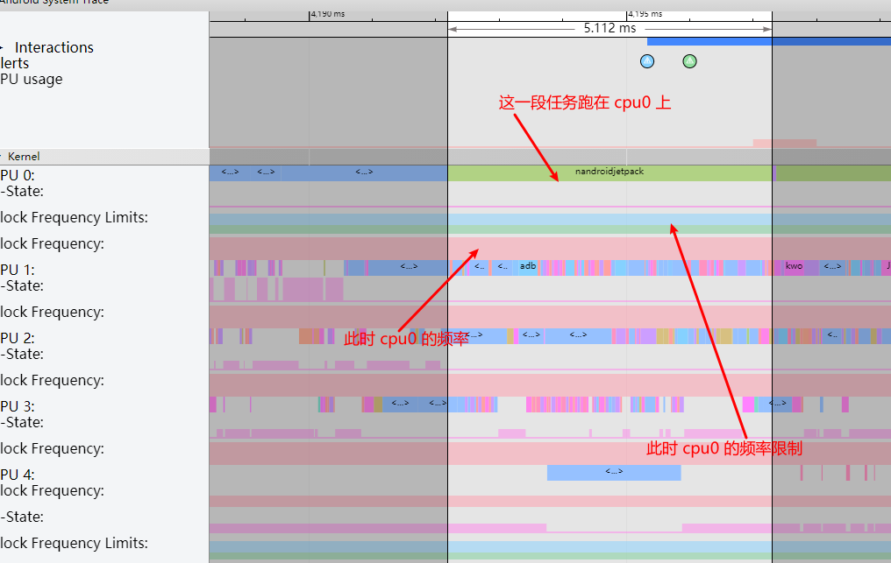

# Systrace——响应速度分析

## 响应速度主要场景

响应慢 表现为点击效果延迟、操作等待、白屏时间过长。主要场景：

- App启动场景：冷启动(新开app)、热启动(后台恢复app)、温启动(连续back退出的app)
- 界面跳转场景：App内页面跳转，App之间跳转
- 非跳转的点击：开关、弹窗、长按、控件选择、单击、双击...
- 亮屏/灭屏、开关机、解锁、人脸识别、拍照、视频加载...

衡量一个场景的响应速度，通常从时间触发开始计时，到App处理完成结束计时，这段时间称为响应时间。

响应速度场景以Input事件触发，由message的执行结尾；响应速度的问题，通常就是Message的某个执行超过预期(主观)，导致最终完成时间>用户期待时间

## 响应速度先决条件——起点与终点

响应速度指标对比：1、竞品分析；2、上一版本

起点：点击事件 or 自定义触发事件 开始

终点：目前市面上使用高速相机 + 图像识别来做是一个比较主流的做法

## 响应速度慢的原因

### Android系统原因导致响应慢

1. **CPU频率不足**

   app表现：主线程running，耗时变长

2. CPU大小核调度：核心任务掉到小核

   app表现：主线程running，耗时变长

3. **SystemServer繁忙**

   1. **响应app主线程 Binder调用耗时**

      app表现：主线程sleep，等待Binder调用返回

   2. **app启动过程逻辑耗时**

      app表现：主线程sleep，等待Binder调用返回

4. **SurfaceFlinger繁忙，主要影响RenderThread的dequeueBuffer、queueBufer**

   app表现：查看RenderThread的dequeuBuffer、queueBuffer处于Binder等待状态

5. 系统低内存，大概率会出现下列情况，都会对SystemServer和App有影响

   1. 低内存的时候，有些app会频繁被杀和启动，而app启动时一个重操作，会占用CPU资源，导致前台app启动变慢

      app表现：app主线程Runnable状态变多，Running状态变少，整体函数执行耗时增加

   2. 低内存的时候，很容易触发各个进程的GC，用于内存回收的HeapTaskDeamon、kswapd0出现的非常频繁

      app表现：app主线程Runnable状态变多，Running状态变少，整体函数执行耗时增加

   3. 低内存会导致磁盘IO变多，如果频繁进行磁盘IO，由于磁盘IO很慢，app会有很多进程处于等待IO的状态也就是Uninterruptible Sleep。

      app表现：app主线程Uniterruptible Sleeep 和 Uniterruptible Sleep IO 状态变多，Running状态变少，整体函数执行耗时增加

6. 温度过高，CPU最高频率被限制

   app表现：主线程处于Running状态，但是执行耗时变长

7. 整机CPU繁忙：可能有多个高负载进程同时在运行 or 单个进程负载高跑满了CPU

   app表现：CPU所有核心上都有任务在执行，App主线程、渲染线程多处于Runnable状态 or 在Runnable—Running之间频繁切换

### App自身原因导致响应慢

1. Application.onCreate：应用自身逻辑 + 三方SDK初始化耗时
2. Activity 的生命周期函数：onStart、onCreate、onResume耗时
3. Service 的生命周期函数耗时
4. Broadcast Receiver 的onReceive耗时
5. ContentProvider初始化耗时
6. 界面布局初始化：measure、layout、draw 耗时
7. 渲染线程初始化：setSurface、queueBuffer、dequeueBuffer、Textureupload 耗时
8. Activity跳转：从SplashActivity 到 MainActivity耗时
9. app向主线程post的耗时Message 耗时
10. 主线程 or 渲染线程 等待子线程数据更新  耗时
11. 主线程 or 渲染线程 等待子进程数据更新  耗时
12. 主线程 or 渲染线程 等待网络数据更新  耗时
13. 主线程 or 渲染线程 Binder调用  耗时
14. WebView 初始化耗时
15. 初次运行JIT耗时

## 响应速度问题分析套路

1. 明确启动时间的起点 与 终点
2. 分析Systrace
   1. 首先查看应用耗时点，分析对比机差异，可以将app启动阶段分为五个部分，来对比哪一部分时间增加了
      - Application 创建
      - Activity 创建
      - 第一个 doFrame
      - 后续内容加载
      - app自己的Message
   2. 分析app耗时的点
      1. 如果是某一段方法自身执行耗时久(Running)——app自身问题
      2. 主线程是否有大段Running状态，但是底下没有任何堆栈——app自身问题，加TraceTag 或者 TraceView来找到对应的代码逻辑
      3. 是否等待Binder耗时比较久(Sleep)——检查Binder服务端，一般是SystemServer
      4. 是否在等待子线程返回数据(Sleep)——app自身问题，查看wakeup信息，找到依赖的子线程
      5. 是否在等待子线程返回数据(Sleep)——app自身问题，查看wakeup信息，找到依赖的子进程 or 其他进程(一般是ContentProvider所在进程)
      6. 是否有大量的Runnable——系统问题，查看CPU部分信息，是否已经跑满
      7. 是否有大量的IO等待——检查系统是否已经**低内存**
      8. RenderThread 是否执行 dequeueBuffer 和 queueBuffer耗时 —— 查看 SurfaceFlinger
   3. 如果分析是系统的问题，一般优先查看系统是否异常，主要关注4个区域
      1. Kernel 区域
         1. 查看关键任务是否跑在了小核 –> **一般小核是 0-3（也有特例），如果启动时候的关键任务跑到了小核，执行速度也会变慢**
         2. 查看频率是否没有跑满 –> **表现是核心频率没有达到最大值，比如最大值是 2.8Ghz，但是只跑到了 1.8Ghz，那么可能是有问题的**
         3. 查看 CPU 使用率，是否已经跑满了 –> **表现是 CPU 区域八个核心上，任务和任务之间没有空隙**
         4. 查看是否低内存
            1. **应用进程状态有大量的 Uninterruptible Sleep | WakeKill - Block I/O**
            2. **HeapTaskDeamon 任务执行频繁**
            3. **kswapd0 任务执行频繁**
      2. SystemServer进程区域
         1. input 事件读取和分发是否有异常 –> **表现是 input 事件传递耗时，比较少见**
         2. binder 执行是否耗时 –> **表现是 SystemServer 对应的 Binder 执行代码逻辑耗时**
         3. binder 等 am、wm 锁是否耗时–> **表现是 SystemServer 对应的 Binder 都在等待锁，可以通过 wakeup 信息跟踪等锁情况，分析等锁是不是由于应用导致的**
         4. 是否有应用频繁启动或者被杀 –> **在 Systrace 中查看 startProcess，或者查看 Event Log**
      3. SurfaceFlinger进程区域
         1. dequeueBuffer 和 queueBuffer 是否执行耗时 –> **表现是 SurfaceFlinger 的对应的 Binder 执行 dequeueBuffer 和 queueBuffer 耗时**
         2. 主线程是否执行耗时 –> **表现是 SurfaceFlinger 主线程耗时，可能是在执行其他的任务**
      4. Launcher进程区域
         1. Launcher 进程处理点击事件是否耗时 –> **表现在处理 input 事件耗时**
         2. Launcher 自身 pause 是否耗时 –> **表现在执行 onPause 耗时**
         3. Launcher 应用启动动画是否耗时或者卡顿 –> **表现在动画耗时或者卡顿**
   4. 初步分析之后：
      1. 如果是系统原因：看app能否规避，无法处理交给系统处理
      2. 如果是app自身原因：可以使用TraceView、Simple Perf等继续查看更加详细的函数调用信息，也可以使用 TraceFix 插件，插入更多的 TraceTag 之后，重新抓取 Systrace 来对比分析

## App冷启动流程分析

1. 触摸屏中断处理阶段

   点击屏幕会触发若干个中断，这些信号经过处理之后，触摸屏驱动会把这些点更新到 EventHub 中，让 InputReader 和 InputDIspatcher 进行进一步的处理

2. InputReader 和 InputDispatcher 处理 Input 事件阶段

3. Launcher处理  Input 事件 阶段

   Launcher 在收到 up 事件后，会进行逻辑判断，然后启动对应的 App（这里主要是交给 AMS 来处理，又回到了 SystemServer 进程）

4. SystemServer处理 StartActivity 阶段

   1. 处理启动命令：该system_server进程中的binder调用是launcher通过ActivityTaskManager.getService().startActivity 调用过来的
   2. fork新进程：判断启动的Activity的app进程如果没有启动，需要首先启动进程，然后再启动Activity，这是冷启动与其他启动的区别；
   3. app进程出现：app进程fork出来后被调用，初始化Message机制，主线程Message机制开始运行

5. app进程启动阶段：

   1. app进程启动到splashActivity第一帧显示

   2. SplashActivity第一帧显示到主Activity第一帧显示

      大部分的 App 都有 SplashActivity 来播放广告，播放完成之后才是真正的主 Activity 的启动

   3. 主Activity第一帧显示到界面完全加载并显示

## Systrace中分析Sleep、Running、Runnable状态下的Task

### 1、如何分析Sleep下的Task

Sleep 有两种，即应用主动 Sleep 和被动 Sleep

- nativePoll 这种，一般属于主动 Sleep，因为没有消息处理了，所以进入 Sleep 状态等待 Message，这种一般是正常的

- 被动 Sleep 一般是由**用户主动调用 sleep**，或者 **Binder 与其他进程进行通信**，这个是我们最常见的，也是分析性能问题的时候经常会遇到的，**需要重点关注**

  这种一般可以点击这个 Task 最下面的 binder transaction 来查看 Binder 调用信息，比如

  

  有时候没有 Binder 信息，是被其他的等待的线程唤醒，那么可以查看唤醒信息，也可以找到应用是在等待什么

  

### 2、如何分析Running下的Task

Running 状态的任务就是目前在 CPU 某一个核心上运行的任务，如果某一段任务是 Running 状态，且耗时变长，那么需要分析

1. 是否应用的本身逻辑耗时，比如新增了某些代码逻辑

2. 任务是否跑到了小核上

   

### 3、如何分析Runnable下的Task

一个线程：Sleep->Runnable->Running

​	

正常情况下，应用进入 Runnable 状态之后，会马上被调度器调度，进入 Running 状态，开始干活；但是在系统繁忙的时候，应用就会有大量的时间在 Runnable 状态，因为 cpu 已经跑满，各种任务都需要排队等待调度

如果应用启动的时候出现大量的 Runnable 任务，那么需要查看系统的状态
