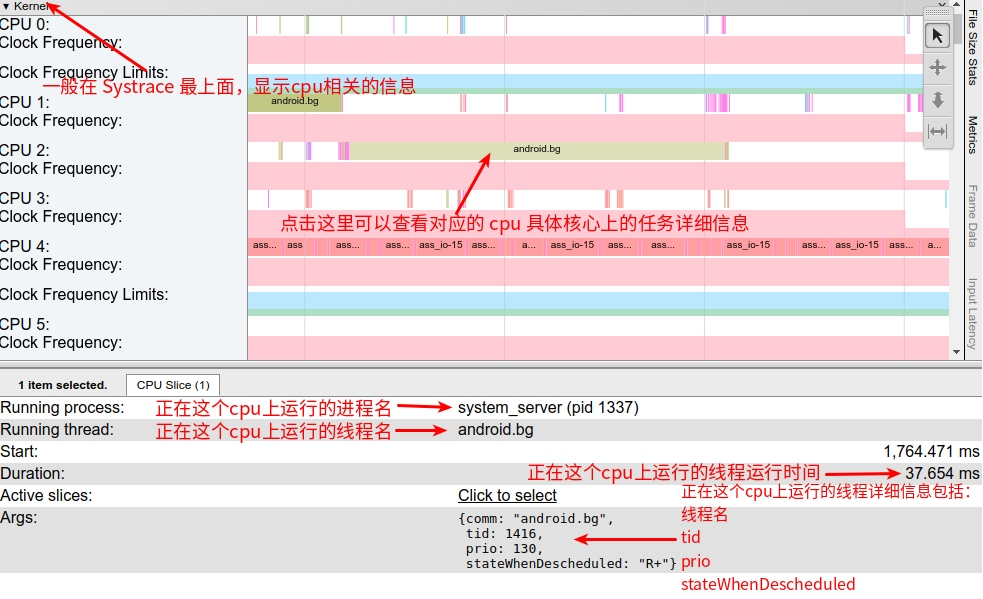

# 1.四大组件是什么？分别的作用是？

- Activity 活动；用户交互的可视化界面
- Service 服务；没有可视化界面，运行于后台处理耗时的逻辑，为其他组件提供基础服务
- BroadcastReceiver 广播接收器；用于监听 / 接收 应用发出的广播消息，并做出响应
- ContentProvider 内容提供者；为存储数据与访问数据(通讯录，相册)提供统一接口，实现应用程序之间共享数据

# 2.Activity的生命周期

正常情况下一个Activity会经历七个生命周期

1. onCreate：在Activity第一次创建时调用，通常做一些初始化设置，不可见，只在Activity创建时执行一次
2. onStart：在Activity即将可见时调用，可见，在Activity中多次调用，不在前台，不可交互，初始化工作
3. onResume：在Activity获取焦点开始与用户交互时调用，在前台，用户可见
4. onPause：在当前Activity被其它Activity覆盖或锁屏时调用，可见，程序状态的保存，独占设备和动画的关闭，以及一些数据的保存最好在onPause中进行，但不能太耗时
5. onStop：在Activity对用户不可见时调用，不可见，其对象还在内存中，系统内存不足时可能不会执行onStop()方法
6. onDestroy：Activity即将被销毁时调用
7. onReStart：在Activity从Stop状态再次启动时调用

# 3.APP的启动流程

可以分为四个部分：**启动app进程、开启app主线程、创建初始化Application/Activity、UI绘制**

1. 点击App图标，Launcher调用startActivity函数，通过binder发送消息给system_server;在system_server中由AMS通过socket通信请求Zygote进程fork出一个App子进程

2. App进程启动后，会实例化一个ActivityThread,执行main方法，同时创建ApplicationThread、Looper、Handler对象，开启主线程消息循环Looper.loop()

3. 创建并初始化Application和Activity，ActivityThread的main方法中调用attach方法进行Binder通信，通知system_server进程执行AMS的attachApplication方法。

   在attachApplication中AMS通过bindApplication,scheduleLaunchActivity方法告知App进程的主线程Handler，对App进程的Application和Activity进行初始化，并执行它们的生命周期

4. Handler初始化Activity时，会执行创建PhoneWindow,初始化DecorView，并添加布局到DecorView中的ContentView。

# 4.性能问题可以分几类？每一类举例说明

# 5.启动类问题分析步骤，启动类问题分为哪几类？

# 6.滑动类问题如何分析？

# 7.线程的编译类型，编译方式是什么？

# 8.CPU通常哪有几种配置？

单核 6+2

4核 4+4

8核 4+3+1

# 9.线程的状态有哪几类？

Sleeping

Runnable

Running

Uninterruptible Sleep - IO Block IO慢

Uninterruptible Sleep 内存管理

# 10.每个状态在此耗时过久时，有什么原因？

1. Sleep：
2. Runnable 耗时过久原因：
   - 后台有太多任务在跑？
   - 没有及时处理是因为频率太低？
   - 没有及时处理是因为被限制到某个cpuset里，但是CPU很满？
   - 此时running的任务是什么？
3. Running 耗时过久原因：
   - 是否频率不够？
   - 是否跑在了小核上？
   - 是否频繁在Running和Runnable之间切换？为什么？
   - 是否频繁在Running和Sleep之间切换？为什么？
4. Uniterruptible Sleep IO Block：IO过慢
5. Uniterruptible Sleep：

# 11.iq、oq、wq、aq分别指什么？

- iq：InBoundQueue，InputDispatcher从InputReader拿到的input事件
- oq：OutBoundQueue，将要派发给各个App的事件
- wq：WaitQueue，记录已经派发给App，但是App还在处理，没有返回处理成功的事件
- aq：PendingInputEventQueue，记录应用需要处理的input事件，input事件已经传递到了应用进程

# 12.Surfaceflinger里面可以捕获到哪些丢帧的信息？

# 13.应用主线程可以看到哪些信息？

# 14.CPU部分可以看到哪些信息？

运行在CPU上的进程，运行在CPU上的线程，运行时间

# 15.30hz,60hz,90hz,120hz的刷新率代表什么？

# 16.Linux常见的进程状态？

# 17.快捷键的使用？

## Systrace

W A S D 

## perfetoo

# 18.AMS，WMS的全称以及对应的作用？

ActivityManagerService：也是上层APP打交道最多的系统服务之一（几乎所有的APP应用都需要与AMS打交道）

**AMS主要负责Android系统中四大组件的启动、切换、调度以及应用进程管理和调度工作**

Activity Manager Service (AMS)是Android中用来管理Activity生命周期的服务，它的主要功能是跟踪和管理应用程序中的Activity状态，例如Activity的创建、销毁、启动、停止等等。AMS负责启动新的Activity，并将其添加到应用的任务栈中，还负责根据优先级和内存的使用情况，结束低优先级的Activity来释放系统资源。

WindowManagerService：管理着所有的窗口，包括创建、删除和修改，以及将某个窗口设置为焦点窗口。

WindowManagerService 负责管理Android中所有窗口的位置、大小、层级以及其他属性，它还负责处理用户输入事件并将它们传递给目标窗口。WMS还支持窗口动画、悬浮窗口和屏幕截图等功能，是Android系统中非常重要的一个组件。

# 19.Input的组成是由哪两个native线程组成？

- InputReader：InputReader负责从EventHub里面把Input事件读取出来，然后交给 InputDispatcher 进行事件分发

- InputDispacther：InputDispatcher在拿到InputReader获取的事件之后，对事件进行包装后，寻找并分发到目标窗口

# 20.APP与SurfaceFlinger的交互主要集中在哪三点？

1. VSync信号的接收和处理
2. RenderThread的queueBuffer
3. RenderThread的dequeueBuffer

​	

# 21.通常我们通过Systrace判断应用是否掉帧的时候，一般是直接看SurfaceFlinger部分，主要哪些步骤？

通常我们通过 Systrace 判断应用是否**掉帧**的时候，一般是直接看 SurfaceFlinger 部分，主要是下面几个步骤

1. surfaceFlinger的主线程在每个VSync-sf到来时有没有合成？

2. 如果没有合成，看没有合成的原因？

   1. SurfaceFlinger检查发现没有可用的Buffer，所以没有合成？
   2. SurfaceFlinger被其他的工作占用(截图、HWC)？
   3. SurfaceFlinger在等待presentFence？
   4. SurfaceFlinger在等待GPU fence？

3. 如果有合成操作，看目标App的可用Buffer个数是否正常：

   如果App可用Buffer为0---看App端为什么没有及时queueBuffer，因为SurfaceFlinger合成操作触发可能是其他的进程有可用的Buffer

# 22.从APP绘制到屏幕显示，分为六个阶段，请概括下？

# 23.绘制分为哪两个种类？区别是什么？

# 24.CPU info中可以看到哪些信息？

# 25.写出RUNNING线程耗时久的原因？

# 26.写出RUNNABLE线程耗时久的原因？

# 27.写出IO等待和SLEEPING线程耗时久的原因？

# 28.编译方式和对应编译类型说明？

# 29.谈谈对triple buffer的理解？

- **Single Buffer 只有在理想情况下，并且设置了offset时间**，间隔offset时间后，SurfaceFlinger收到Vsync信号，开始合成；

  如果渲染或者合成在下一次Vsync到来之前没有完成，就会tearing

- Double Buffer ：app生产buffer同时，surfaceflinger也能使用buffer合成

  App 连续两帧生产都超过 Vsync 周期(准确的说是错过 SurfaceFlinger 的合成时机) ，就会出现掉帧情况

- Triple Buffer ：
  - 缓解掉帧
  - 减少UI Thread 和 RenderThread 的等待时间
  - 降低CPU和GPU瓶颈，有效降低dequeuBuffer时间

# 30.android是基于choreographer做渲染机制的，请写出chreographer的主要作用？

引入VSync是为了协调BufferQueue的生产者生成动作与SurfaceFlinger消费者的合成消费动作，避免出现tearing

choreographer 编舞者 用于控制帧的生成节奏，使得尽量在VSync信号到来时，CPU/GPU就开始制作帧数据。

如果每个VSync周期，app都能渲染完成，fps达到60,就会很流畅

# 31.对于流畅性问题和时延类问题，分别有哪些请举例来说明。

