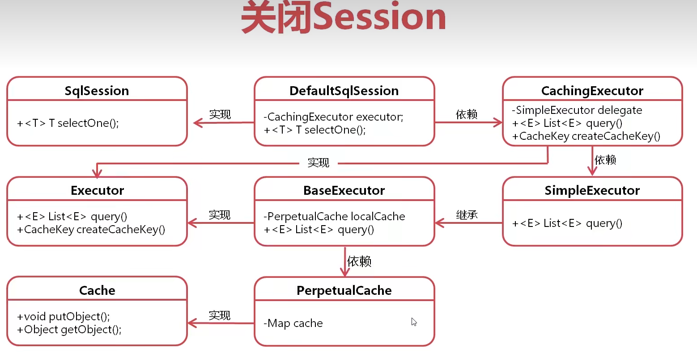
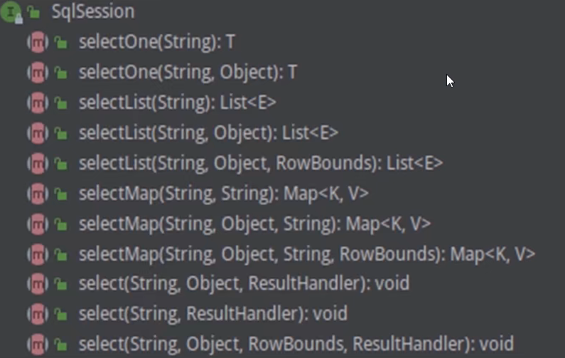
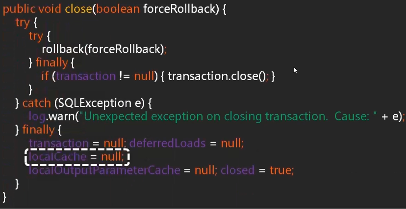
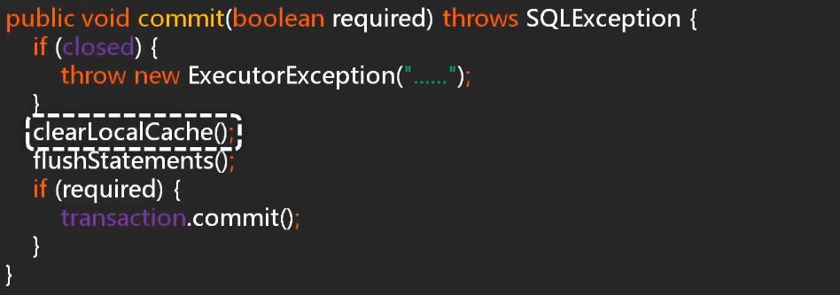
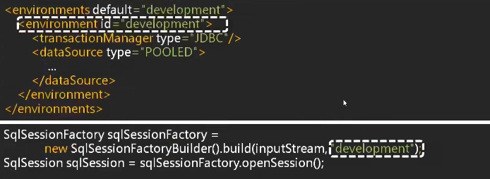
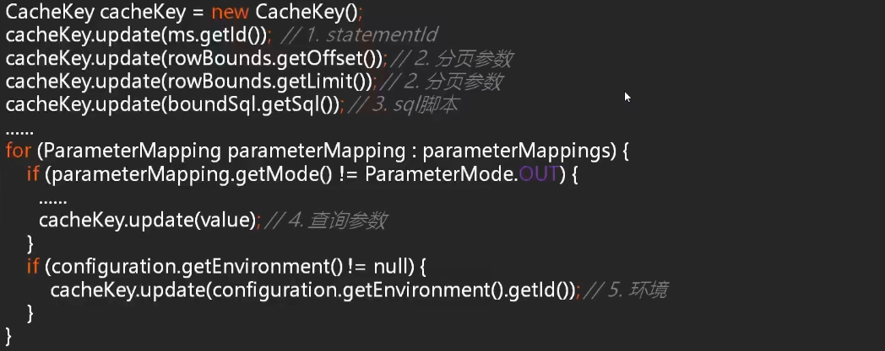
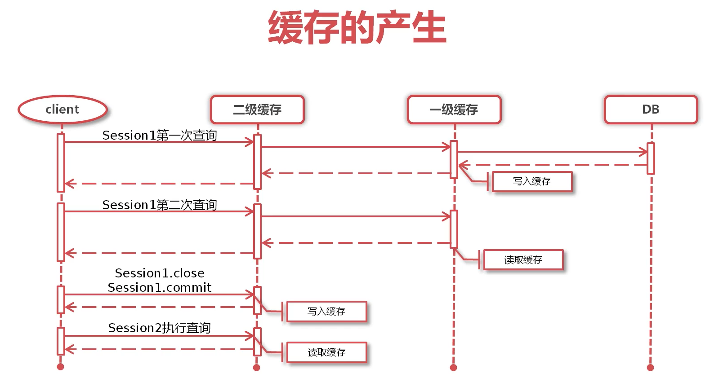
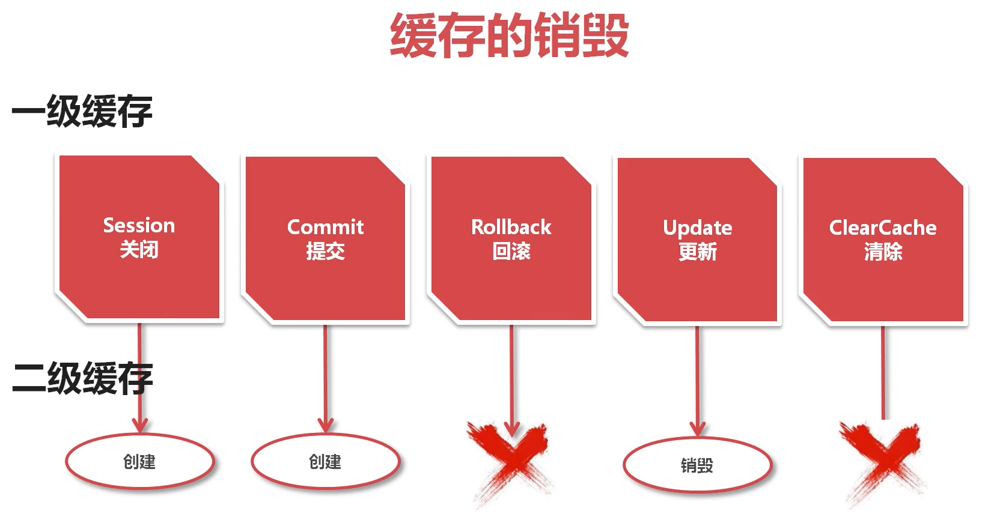
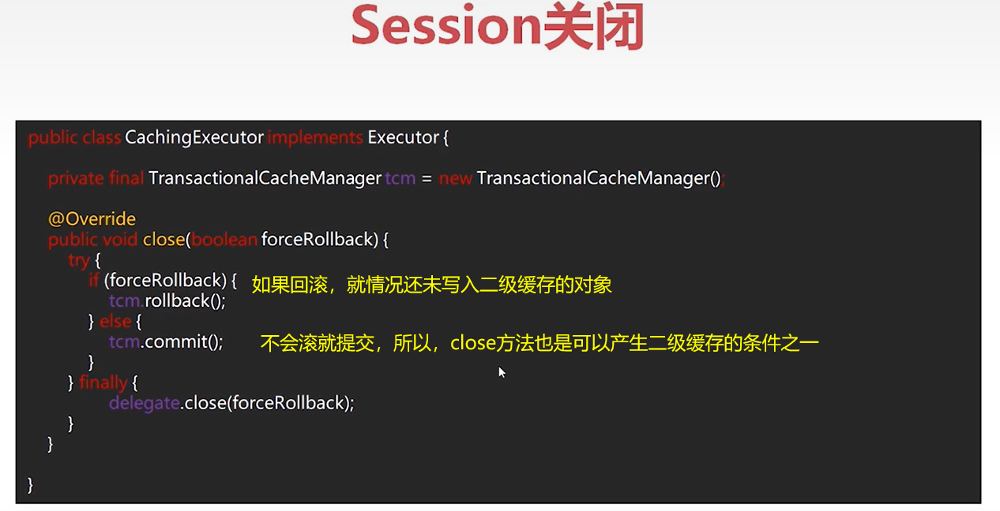

# mybatis缓存

## 为什么使用缓存?

​		由于**从硬盘读取**数据相对来说比较**慢**,当**大批量查询**(淘宝双11点击量暴增)时,数据库的压力较大,可以将**第一次**查询到的数据**放在内存**中而不销毁它,下次若查询该数据时可以直接从内存中获取,减少对数据库的查询次数,提高了数据库的性能.

​		 缓存是使用 **Map** 集合缓存数据的 .

- 一级缓存:**sqlSession级别**,在一次会话中保存数据,会话结束后缓存中的数据销毁
- 二级缓存: **SqlSessionFactory**级别的 

## 一级缓存

### 认识一级缓存

**Mybatis 默认开启一级缓存 .**

- 一级缓存的作用域是同一个 **SqlSession**， 在同一个 **sqlSession** 中两次执行相同的 sql 语句，第一次执行完毕会将数据库 中查询的数据写到缓存（内存），第二次会从缓存中获取数据将不再从数据库查询，从而提高查询效率。

- 第一次将查询结果写入缓存，在第二次查询之前，发生了增删改等写操作，那么SQLSession中的缓存会被清空，每次查询会先去缓存中找，找不到再去数据库查询，再将结果写入缓存。

- 当一个 **sqlSession** 结束后该 **sqlSession** 中的一级缓存也就不存在了。 
- MyBatis内部缓存使用一个HashMap，key为`hashcode+statementId+sq`l语句，value为结果集映射的java对象。
- SQLSession执行insert、update、delete等操作，commit后会清空SQLSession缓存

我们使用上面的按年龄查询的方法测试mybatis的一级缓存

两个对象执行相同的查询,查询次数为2,因为一级缓存在与同一个sqlSession对象中

```java
	@Test
	//找年龄<21的
    public void find6(){
    	//sqlSession对象1
        SqlSession sqlSession = MybatisUtil.getSqlSession();
        EmployeeMapper mapper = sqlSession.getMapper(EmployeeMapper.class);
        mapper.findEmployeeByAge2(21);
        sqlSession.commit();
        sqlSession.close();
		
		//sqlSession对象2
        SqlSession sqlSession1 = MybatisUtil.getSqlSession();
        EmployeeMapper mapper1 = sqlSession1.getMapper(EmployeeMapper.class);
        mapper1.findEmployeeByAge2(21);
        sqlSession1.commit();
        sqlSession1.close();
    }
```


一个对象执行两次相同的查询,只查询了一次

```java
	@Test
	//找年龄<21的
    public void find6(){
        SqlSession sqlSession = MybatisUtil.getSqlSession();
        EmployeeMapper mapper = sqlSession.getMapper(EmployeeMapper.class);
        mapper.findEmployeeByAge2(21);
        mapper.findEmployeeByAge2(21);
        sqlSession.commit();
        sqlSession.close();
    }
```


一个对象执行两次不同的查询

```java
	@Test
	//找年龄<21的
    public void find6(){
        SqlSession sqlSession = MybatisUtil.getSqlSession();
        EmployeeMapper mapper = sqlSession.getMapper(EmployeeMapper.class);
        mapper.findEmployeeByAge2(21);
        mapper.findEmployeeByAge2(22);
        sqlSession.commit();
        sqlSession.close();
    }
```


### 关闭一级缓存

配置flushCache为true

`<select  flushCache="true">`


### 一级缓存的生命周期

#### 概述

1. MyBatis 在**开启**一个数据库会话时，会创建一个新的 **SqlSession** 对象， **SqlSession** 对象中会有一个新的 **Executor** 对象。**Executor** 对象中持有一个新的 **PerpetualCache** 对象,如果 **SqlSession** 调用了 **close**()方法，会释放掉一级 缓存 **PerpetualCache** 对象，一级缓存将不可用。 
2. 如果 **SqlSession** 调用了 **clearCache**()，会清空 **PerpetualCache** 对象 中的数据，但是该对象仍可使用。 
3. **SqlSession** 中执行了任何一个 **update** 操作(**update**()、**delete**()、 **insert**()) ，都会清空 **PerpetualCache** 对象的数据，但是该对象可以继续使用 




#### 一级缓存的产生

**SqlSession的一系列select方法，其他方法不会产生缓存**

MyBaits产生一级缓存与映射文件中的`<select></select>`标签没有关系，取决于SqlSession的一系列select方法，如果调用了非select方法，就算标签是select，也无法产生缓存



#### 销毁一级缓存

select的flushCache（清空缓存）默认为false，而update，insert，delect的flushCache（清空缓存）默认为true。

- 执行`sqlSession.close()`方法关闭Session会话,会清空一级缓存

- 执行`sqlSession.commit()`提交or`sqlSession.rollback()`回滚后会清空一级缓存

- **sqlSession.clearCache()**主动清空一级缓存

- **insert、delete、update**等操作会清空一级缓存

1. clearCache()清空一级缓存

```java
	@Test
    public void find7(){
        SqlSession sqlSession = MybatisUtil.getSqlSession();
        EmployeeMapper mapper = sqlSession.getMapper(EmployeeMapper.class);

        mapper.findEmployeeByAge2(21);

        //clearCache清空一级缓存的数据
        sqlSession.clearCache();

        mapper.findEmployeeByAge2(21);
        sqlSession.commit();
        sqlSession.close();
    }
```


2. 增删改清空一级缓存

```java
	@Test
	//增删改会清空当前SQLSession对象中的缓存(防止数据脏读)
    public void find8(){
        SqlSession sqlSession = MybatisUtil.getSqlSession();
        EmployeeMapper mapper = sqlSession.getMapper(EmployeeMapper.class);

        mapper.findEmployeeByAge2(21);

        Employee employee = new Employee();
        employee.setName("王玄策123");
        employee.setSex("男");
        Dept dept = new Dept();
        dept.setId(2);
        employee.setDept(dept);
        mapper.updateEmp(employee);

        mapper.findEmployeeByAge2(21);
        sqlSession.commit();
        sqlSession.close();
    }
```


### 一级缓存的源码

1. **close()关闭SqlSession (BaseExcutor)**

   

2. **commit 提交(BaseExcutor)**

   


3. **rollback 回滚** 

   

4. **clearLocalCache()**

   

5. **update、insert、delete 操作** ,update调用了clearLocalCache()，insert和delete都是调用update方法来执行的

   

   

   

   


### 一级缓存的命中原则

MyBatis如何判断两次查询是完全相同的？

1. **两次查询的StatementId相同**，也就是dao层的方法名，映射文件中的select语句中的id必须相同`<select id="">`，否则就算SQL语句、参数完全一样也不行

2.  **传递给查询SQL的参数必须相同**，否则无法命中缓存

   只要传递给sql的参数相同，不是同一个参数对象，也是可以命中缓存的，如下图

   

3.  **分页参数必须相同**，否则无法命中缓存，缓存的粒度是整个分页查询结果，不是结果中的每个对象

4. **要求传递给JDBC的SQL语句是完全相同的**

   

5. **要求执行环境相同**

   

命中原则的源码:BaseExcutor中的createCacheKey方法



注意：

**Spring集成MyBatis后**

- **不开启事务，每次请求都会关闭上一个SqlSession，开启新的SqlSession，所以不开启事务，一级缓存是无效的**

- **开启事务后，Spring通过ThreadLocal始终使用的是同一个SqlSession，一级缓存有效**


## 二级缓存

### 概述

​		二级缓存是**SqlSessionFactory**级别的(SqlSessionFactory只有一个),根据Mapper的`namespace` 划分区域的.

​		多个SqlSession共享二级缓存

​		相同 `namespace` 的 **mapper** 查询的数据缓存在同一个区域，如果使用 **mapper** 代理方法每个 **mapper** 的 `namespace` 都不同，此时可以理解为二级缓存区域是根据 **mapper** 划分。 

 每次查询会**先从缓存区**域查找，如果找不到则从数据库查询，并将查询到数据写入缓存。Mybatis 内部存储缓存使用一个 **HashMap**，==key== 为 ==hashCode==+==sqlId==+==Sql== 语句。**value** 为从查询出来**映射生成**的 j**ava** 对象。 sqlSession 执行 insert、update、delete 等操作 commit 提交后会清空缓存区域，防止脏读。 

### 配置二级缓存

1. **启用二级缓存**

   mybatis默认不开启二级缓存

   在Mybatis.xml配置文件中配置

   ```xml
   <settings>
   	<setting name="cacheEnabled" value="true"/>
   </settings>
   ```

2. **POJO序列化**(所有)

   所有POJO类(自定义类)实现序列化接口( Java.io. Serializable )

3. **配置映射文件**(`<cache/>`)

   AdminMapper.xml

   ```xml
   <mapper namespace="com.demo.mybatispro.mapper.AdminMapper">
   	<cache/>
   </mapper> 
   ```

   在 Mapper 映射文件中添加`<cache/>`，表示此 mapper 开启二级缓存

   当 SqlSeesion 关闭时,会将数据存入到二级缓存 

当一个SqlSession对象**关闭**后(一次会话结束),数据存入二级缓存

SqlSessionFactory中的其他SqlSession对象依旧可以使用二级缓存中的数据

```java
	@Test
    public void find9(){
        SqlSession sqlSession = MybatisUtil.getSqlSession();
        EmployeeMapper mapper = sqlSession.getMapper(EmployeeMapper.class);
        mapper.findEmployeeByAge2(21);
        sqlSession.commit();
        sqlSession.close();
        //commit、rollback、
        //sqlSession关闭后,将数据存放到二级缓存中,同一个sqlSessionFactory的sqlSession对象共缓存

        SqlSession sqlSession1 = MybatisUtil.getSqlSession();
        EmployeeMapper mapper1 = sqlSession1.getMapper(EmployeeMapper.class);
        mapper1.findEmployeeByAge2(21);
        sqlSession1.commit();

        SqlSession sqlSession2 = MybatisUtil.getSqlSession();
        EmployeeMapper mapper2 = sqlSession2.getMapper(EmployeeMapper.class);
        mapper2.findEmployeeByAge2(21);
        sqlSession2.commit();

    }
```


### 二级缓存的生命周期

#### 二级缓存的产生：满足两个条件

1. **执行SqlSession的select系列方法(满足一级缓存)**
2. **SqlSession.close()、 SqlSession.commit()** 



#### 二级缓存的销毁

缓存的销毁：

- 一级缓存是销毁一个SqlSession中的所有查询数据

- 二级缓存是销毁同一个namespace 下Mapper中的所有查询数据


clearCache()是清空一个SqlSession中查询数据,因此不能清空二级缓存




### 二级缓存的命中原则

与一级缓存命中原则一样，只是作用域不同，一级作用域sqlSession，二级作用域sqlSessionFactory

在同一个SqlSessionFactory中：

1. **两次查询的StatementId相同**，也就是dao层的方法名，映射文件中的select语句中的id必须相同`<select id="">`，否则就算SQL语句、参数完全一样也不行

2.  **传递给查询SQL的参数必须相同**，否则无法命中缓存

    只要传递给sql的参数相同，不是同一个参数对象，也是可以命中缓存的

3.  **分页参数必须相同**，否则无法命中缓存，缓存的粒度是整个分页查询结果，不是结果中的每个对象

4. **要求传递给JDBC的SQL语句是完全相同的**

5. **要求执行环境相同**


### 二级缓存源码





## 关于Mybatis缓存的一些配置参数

### useCache 和 flushCache

- useCache 写入缓存

  - **useCache="false"：不会将本条语句的结果写入二级缓存**

  - **useCache="true"：表示会将本条语句的结果写入二级缓存**

- flushCache 刷新缓存(清空缓存)

  - **flushCache="false"：语句被调用都不会清空一级缓存和二级缓存**

  - **flushCache="true"：语句被调用会导致一级缓存和二级缓存被清空**


sql标签的默认配置


update 配置 flushCache="false"的话，执行更新操作后，缓存中的数据还是修改之前的

### eviction 清除策略  与 size 引用数目

**eviction**

- LRU：最近最少使用。移除最长时间不被使用(命中)的缓存对象-->LinkedHashMap
- FIFO：按缓存对象进入缓存的顺序来移除-->LinkedList
- SOFT：软引用，基于GC和软引用的规则移除缓存对象-->SoftReference
- WEAK：弱引用，基于GC和弱引用的规则移除缓存对象-->WeakReference

**size**

- 缓存引用的最大数目，默认1024。

- 当缓存引用数达到指定值时，按照eviction的策略来清除缓存对象


### flushInterval、readOnly、blocking

- **flushInterval**：刷新间隔时间，单位ms，如果不配置，那么会在SQL执行的时候再刷新缓存，设置后到时间会移除对象，重新查询写入
- **readOnly**：只读，默认false
  - false：可读写，在创建对象时，通过反序列化得到缓存对象的拷贝，速度慢但安全
  - true：只读，返回缓存对象的相同实例，性能好但不安全
- **blocking**：阻塞，默认false。为true时采用BlockingCache进行封装。使用BlockingCache 会在查询缓存时锁住对应的key，命中缓存会释放锁，否则会在查询数据库之后再释放锁，阻止并发下多线程同时查询数据


