# 分配给Redis的内存用完会发生什么？

# Redis的应用场景

**键的类型只能为字符串，值支持五种数据类型：字符串、散列表、列表、集合、有序集合。**

**redis以key-value方式存储，支持诸多种数据结构：String，Hash，List，Set，Sorted Set**

**1.String字符串**，应用场景最多的数据结构，其他四种是在此基础上实现的，**value可以使简单的字符串、xml、json、数字、二进制。比如我们的新闻就是利用json这种格式存储的。**

**2.Hash**，指的是键值本身也是一种键值对的存储结构，将结构化的信息打包成hashmap，例如key：{{field1:value1},{field2:value2},{field3:value3},{field4:value4}...}

相比string减少了反序列化和序列化的消耗，也不适用于一些并发修改value中某个value的操作。

应用场景：**例如门店/商品/用户信息的管理操作**，但是不同于关系型数据库的结构完全结构化，h**ash的结构是稀疏的，没法做到级联查询。**

**3.List列表**，双端链表实现，可以使用list的一些特性，例如push的方式塞入，pop的方式取出，可以读取某个范围的元素，也可以充当队列使用。有序且可重复。

应用场景：

**文章、任务列表**

**消息队列，Redis的list数据结构是一个双向链表，很容易模拟出队列效果，利用Lpush+Rpop**

**4.Set无序集合**

**应用场景：共同好友，在set集合中，有交集并集补集的api，我们可以把两人的关注的人分别放入到一个set集合中，然后再通过api去查看这两个set集合中的交集数据。**

**5.Sorted Set有序集合**

**应用场景：点赞排行榜，采用一个可以排序的set集合，就是sortedSet**

# Redis的网络模型

## IO多路复用模型

**介绍这里的时候可以先讲一下阻塞IO和非阻塞IO模型的特点，然后引入到这里。**

**在介绍IO多路复用模型之前，先来看一下FD的概念。**

**文件描述符（File Descriptor）：简称FD，是一个从0开始的无符号整数，用来关联Linux中的一个文件。在Linux中，一切皆文件，例如常规文件、视频、硬件设备等，当然也包括网络套接字（Socket）。**

**FD的作用：通过FD，我们的网络模型可以利用一个线程监听多个FD，并在某个FD可读、可写时得到通知，从而避免无效的等待，充分利用CPU资源。**

**IO多路复用模型：**

**当用户去读取数据的时候，不再去直接调用recvfrom了，而是调用select的函数，select函数会将需要监听的数据交给内核，由内核去检查这些数据是否就绪了，如果说这个数据就绪了，就会通知应用程序数据就绪，然后来读取数据，再从内核中把数据拷贝给用户态，完成数据处理，如果N多个FD一个都没处理完，此时就进行等待。**

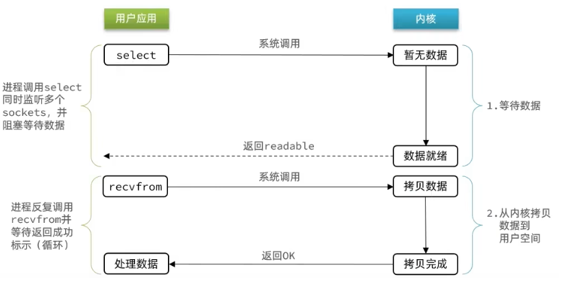

**IO多路复用是利用单个线程来同时监听多个FD，并在某个FD可读、可写时得到通知，从而避免无效的等待，充分利用CPU资源。**

**不过监听FD的方式、通知的方式又有多种实现，常见的有：**

- **select**
- **poll**
- **epoll**

**其中select和pool相当于是当被监听的数据准备好之后，他会把你监听的FD整个数据都发给你，你需要到整个FD中去找，哪些是处理好了的，需要通过遍历的方式，所以性能也并不是那么好**

**而epoll，则相当于内核准备好了之后，他会把准备好的数据，直接发给你，就省去了遍历的动作。**

select是Linux最早是由的I/O多路复用技术：**就是把需要处理的数据封装成FD，比如要监听的数据，是1,2,5三个数据，此时会执行select函数，然后将整个fd发给内核空间，内核态会去遍历用户态传递过来的数据，看看哪个数据准备好了，把准备好的数据写回到用户空间中去，但是对于用户空间而言，并不知道谁处理好了，所以用户空间也需要去进行遍历，然后找到对应准备好数据的节点，缺点：频繁的传递fd集合，频繁的去遍历FD。**

**poll模式对select模式做了简单改进，比如利用链表监听FD上限,但性能提升不明显**

**epoll模式是对select和poll的改进，它提供了三个函数：**

1.**eventpoll**的函数，他内部包含两个东西:红黑树-(记录的是要监听的FD)，一个是链表（记录的是就绪的FD）

2.**epoll_ctl**操作，将要监听的数据添加到红黑树上去，并且给每个fd设置一个监听函数（也可以叫回调函数），这个函数会在fd数据就绪时触发，就是准备好了，就把fd添加到链表中去。

3.**epoll_wait**函数：**当调用这个函数的时候，会去检查链表，检查到了链表中有数据，此时将数据放入到events数组中，并且返回对应的操作的数量，用户态的此时收到响应后，直接从events中拿到对应准备好的数据的节点**，再去调用方法去拿数据。

**面试速记：**

**select模式存在的三个问题：**

- **能监听的FD最大不超过1024**

- **每次select都需要把所有要监听的FD都拷贝到内核空间**

- **每次都要遍历所有FD来判断就绪状态**

  

**poll模式的问题：**

- **poll利用链表解决了select中监听FD上限的问题，但依然要遍历所有FD，如果监听较多，性能会下降**

  

**epoll模式中如何解决这些问题的？**

- **基于epoll实例中的红黑树保存要监听的FD，理论上无上限，而且增删改查效率都非常高**
- **每个FD只需要执行一次epoll_ctl添加到红黑树，以后每次epol_wait无需传递任何参数，无需重复拷贝FD到内核空间**
- **利用ep_poll_callback机制来监听FD状态，无需遍历所有FD，因此性能不会随监听的FD数量增多而下降**

## Redis是单线程的吗？为什么使用单线程

**Redis到底是单线程还是多线程？**

- **如果仅仅聊Redis的核心业务部分（命令处理），答案是单线程**

- **如果是聊整个Redis，那么答案就是多线程，比如网络IO（读取IO和响应IO）和持久化机制中都用到了多线程。**

  

**处理一条命令例如set name jim，需要三步1.读取IO流，2计算（也就是数据处理）3.响应io流（就跟数据库一样插入完后响应给用户的信息），**

 

**Redis6.0之前，所有的IO写入写出和数据处理都是由单worker线程去做的，如果同时有两个客户端操作，那么就以串行的方式执行**

 

**Redis6.0之后，对于IO写入写出会交给IO子线程去处理，核心的计算（就是数据处理）还是由worker单线程去做，用多线程提高了效率。**

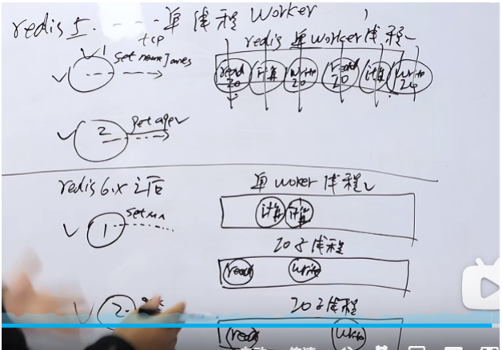

**为什么Redis要选择单线程（这里指核心线程）？**

- **抛开持久化不谈，Redis是纯内存操作，执行速度非常快，它的性能瓶颈是网络延迟而不是执行速度，因此多线程并不会带来巨大的性能提升。**
- **多线程会导致过多的上下文切换，带来不必要的开销**
- **引入多线程会面临线程安全问题，必然要引入线程锁这样的安全手段，实现复杂度增高，而且性能也会大打折扣**

## Redis单线程和多线程网络模型变更

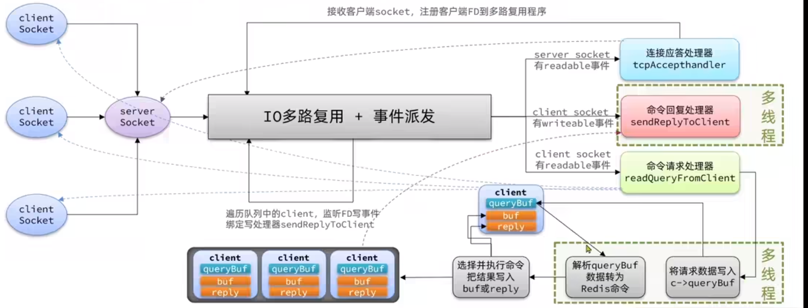

**当我们的客户端想要去连接我们服务器，会去先到IO多路复用模型去进行排队，会有一个连接应答处理器，他会去接收客户端socket，注册客户端FD到多路复用程序。此时这些建立起来的连接，如果客户端请求一条命令时，命令请求处理器会去把数据读取出来（读取IO，读取这条命令），然后把数据放入到client中， clinet去解析当前的命令转化为redis认识的命令，接下来就开始处理这些命令，从redis中的command中找到这些命令，然后就真正的去操作对应的数据了，当数据操作完成后，会去找到命令回复处理器，再由他将数据写出（响应IO，例如你执行了一条set name jim 命令，会响应一个ok）。**

**因为命令是在内存中执行的，非常快，所以限制Redis的更多是网络IO，因此Redis6.x在网络IO这一块引入了多线程，提高了吞吐量。**

## redis为什么快？

**1.Redis是纯内存操作，相对于读写磁盘，redis的执行速度非常快，**

**2.采用多路 I/O 复用技术可以让单个线程高效的处理多个连接请求，可以同时监听多个FD**

**3.redis的核心worker线程是单线程的，单线程的原子操作，避免上下文切换的时间和性能消耗。引入多线程会面临线程安全问题，必然要引入线程锁这样的安全手段，实现复杂度增高，而且性能也会大打折扣**

**4.因为命令是在内存中执行的，非常快，所以限制Redis的更多是网络IO，因此Redis6.x在网络IO这一块引入了多线程，提高了吞吐量。**

**5.虽然redis的核心worker线程是单线程的，但在很多地方都用了多线程，除了网络IO之外，持久化机制中都用到了多线程。例如Redis的持久化机制，Redis发现RDB的事件可执行时，则调用BGSAVE命令,而BGSAVE命令实际上会fork出一个子进程来进行完成持久化（生成RDB文件）,在fork的过程中，父进程(主线程)肯定是阻塞的,但fork完之后，是fork出来的子进程去完成持久化。**

# Redis的持久化机制

**Redis是基于内存的缓存机制,假定Redis服务器中途突然出现故障，那内存的数据就会丢失。针对这个问题,Redis提供了两种持久化方式,分别是RDB和AOF。**

## RDB

**RDB(Redis DataBase)：根据我们自己配置的时间或者手动去执行SAVE命令，Redis就会去生成RDB文件。这是Redis持久化的默认方式。**

**过程：RDB文件实际上就是一个经过压缩的二进制文件，Redis可以通过这个文件在启动的时候来还原我们的数据。**

**虽然Redis是单线程的,定时的RDB实际上就是一个时间事件,Redis发现RDB的事件可执行时，则调用BGSAVE命令,而BGSAVE命令实际上会fork出一个子进程来进行完成持久化（生成RDB文件）,在fork的过程中，父进程(主线程)肯定是阻塞的,但fork完之后，是fork出来的子进程去完成持久化。**

## AOF

**AOF(Append Only File):把Redis服务器接收到的所有写命令都记录到日志中。**

**AOF是在命令执行完之后,把命令写在buffer缓冲区的（直接追加写),可以设置每次操作都记录或者每秒记录一次。Redis会启一个线程去刷盘，也不是用主线程去干的。如果这些写入磁盘的命令集合不做任何处理，随着操作的不断增加,该文件就会变得非常大。fork个子进程会对原始命令集合进行重写,相当于压缩,压缩完替换掉原始文件。**

**解决办法:**

**过程:Redis重跑一遍这个记录下的日志文件，就相当于还原了数据。**

## **两种方式的优缺点**

**RDB：**

**1.RDB在启动的时候恢复数据会比AOF快很多。**
**2.可能会导致部分数据丢失(中途突然宕机,没有轮询到RDB事件)**

**AOF**
**1.数据完整性高**
**2.恢复起来比较慢,需要执行一条条指令。**

**官网是不建议仅仅只使用RDB的，如果对数据丢失容忍度是有要求的，建议是开启AOF+RDB一起用。在Redis4.0以后也支持了AOF和RDB混合，具体使用什么样的持久化方式还是要根据要求。**

# Redis的key过期策略

**Redis是key-value数据库，我们可以设置Redis中缓存的key的过期时间。Redis的过期策略就是指当 Redis中缓存的key过期了，Redis如何处理。** 

1.**立即删除。在设置键的过期时间时，创建一个回调事件，当过期时间达到时， 由时间处理器自动执行键的删除操作。立即删除能保证内存中数据的最大新鲜 度，因为它保证过期键值会在过期后马上被删除，其所占用的内存也会随之释放。 但是立即删除对 cpu 是最不友好的，因为删除操作会占用 cpu 的时间。**

**2.惰性删除**：**某个键值过期后，此键值不会马上被删除，而是等到下次被使用的时候，才会被检查到过期，此时才能得到删除。所以惰性删除 的缺点很明显:浪费内存。该策略可以最⼤化地 节省CPU资源，却对内存⾮常不友好。极端情况可能出现⼤量的过期key没有再次被访问，从而不会被清除，占用大量内存。** 

**3.定期删除**：**每隔⼀定的时间，会扫描一定数量的数据库的expires字典中⼀定数量的key，并清除其** **中已过期的key。该策略是⼀个折中⽅案。通过调整定时扫描的时间间隔和每次扫描的限定耗时，可以在不同情况下使得CPU和内存资源达到最优的平衡效果。** 

**(expires字典会保存所有设置了过期时间的key的过期时间数据，其中，key是指向键空间中的某个键的指针，value是该键的毫秒精度的UNIX时间戳表示的过期时间。键空间是指该Redis集群中保存的所有键。)** 

**Redis中同时使用了惰性过期和定期过期两种过期策略。**

# Redis的内存淘汰算法和原理？

## 淘汰原理

随着系统的运行，redis的数据越来越多，会导致物理内存不足。通过使用虚拟内存（VM），将很少访问的数据交换到磁盘上，腾出内存空间的方法来解决物理内存不足的情况。虽然能够解决物理内存不足导致的问题，但是由于这部分数据是存储在磁盘上，如果在高并发场景中，频繁访问虚拟内存空间会严重降低系统性能。

## 淘汰算法

1. Random算法：随机删除某个key
2. TTL算法：在设置了过期时间的key中找出即将过期的Key进行删除
3. LRU算法：删除最近最少使用的key，基于时间来淘汰
4. LFU算法：删除访问次数最少的key，如果有n个访问次数相同的key，删除最小访问时间戳的key，为key增加了一个计数器，统计Key的访问次数

# 缓存问题

**缓存中存放的⼤多都是热点数据，⽬的就是防⽌请求可以直接从缓存中获取到数据，⽽不⽤访问 Mysql。而这个过程中可能会存在很多问题：**

## 缓存穿透

**缓存穿透：缓存穿透是指客户端请求的数据在缓存中和数据库中都不存在**，这样缓存永远不会生效，这些请求都会打到数据库。（⽐如⿊客故意伪造⼀些乱七⼋糟 的key）

**常见的解决方案有两种：**

- **缓存空对象**

  - 优点：实现简单，维护方便
  - 缺点：
    - 额外的内存消耗
    - 可能造成短期的不一致

- **使⽤布隆过滤器**:

  它的作⽤就是如果它认为⼀个key不存在，那么这个key就肯定不存在，所以可以在缓存之前加⼀层布隆过滤器来拦截不存在的key

  - 优点：内存占用较少，没有多余key
  - 缺点：
    - 实现复杂
    - 存在误判可能

**缓存空对象思路分析：**当我们客户端访问不存在的数据时，先请求redis，但是此时redis中没有数据，此时会访问到数据库，但是数据库中也没有数据，这个数据穿透了缓存，直击数据库，我们都知道数据库能够承载的并发不如redis这么高，如果大量的请求同时过来访问这种不存在的数据，这些请求就都会访问到数据库，简单的解决方案就是哪怕这个数据在数据库中也不存在，我们也把这个数据存入到redis中去，这样，下次用户过来访问这个不存在的数据，那么在redis中也能找到这个数据就不会进入到缓存了

**布隆过滤：**布隆过滤器其实采用的是哈希思想来解决这个问题，通过一个庞大的二进制数组，走哈希思想去判断当前这个要查询的这个数据是否存在，如果布隆过滤器判断存在，则放行，这个请求会去访问redis，哪怕此时redis中的数据过期了，但是数据库中一定存在这个数据，在数据库中查询出来这个数据后，再将其放入到redis中，

假设布隆过滤器判断这个数据不存在，则直接返回。

**这种方式优点在于节约内存空间，存在误判，误判原因在于：布隆过滤器走的是哈希思想，只要哈希思想，就可能存在哈希冲突**

## 缓存击穿

**缓存击穿：某⼀个热点key突然失效**，**也导致了大量请求直接访问Mysql数据库，这就是缓存击穿**

**常见的解决方案有两种：**

- **互斥锁：因为锁能实现互斥性。假设线程过来，只能一个人一个人的来访问数据库，从而避免对于数据库访问压力过大，但这也会影响查询的性能，因为此时会让查询的性能从并行变成了串行**

- **逻辑过期：我们之所以会出现这个缓存击穿问题，主要原因是在于我们对key设置了过期时间，假设我们不设置过期时间，其实就不会有缓存击穿的问题，但是不设置过期时间，这样数据不就一直占用我们内存了吗，我们可以采用逻辑过期方案。**

  

  **我们把过期时间设置在 redis的value中，注意：这个过期时间并不会直接作用于redis，而是我们后续通过逻辑去处理。**

  

  **流程：**

  1.假设线程1去查询缓存，然后从value中判断出来当前的数据已经过期了，此时线程1去获得互斥锁，那么其他线程会进行阻塞，**获得了锁的线程他会开启一个线程去进行以前的重构数据的逻辑，直到新开的线程完成这个逻辑后，才释放锁，而线程1直接进行返回。** 

  

  2.，假设现在线程3过来访问，由于线程2持有着锁，所以线程3无法获得锁，线程3也直接返回数据，**只有等到新开的线程2把重建数据构建完后，其他线程才能走返回正确的数据。**

  **这种方案巧妙在于，异步的构建缓存，缺点在于在构建完缓存之前，返回的都是脏数据。**

  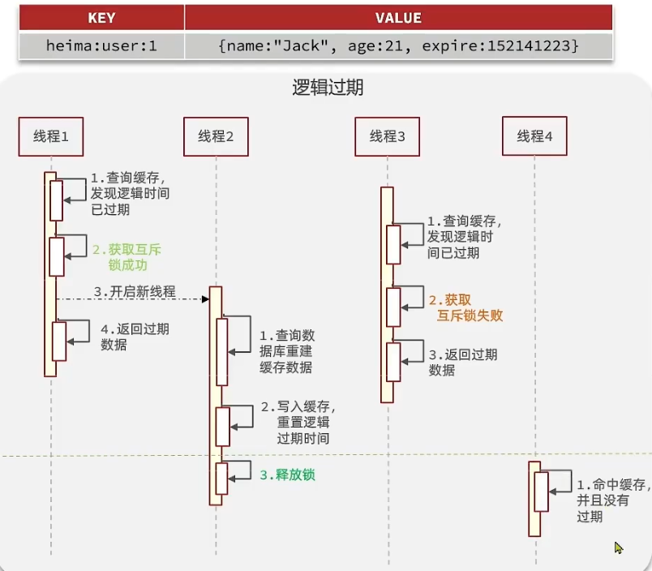

## 缓存雪崩

缓存雪崩：**如果缓存中某⼀时刻⼤批热点数据同时过期**，那么就可能导致⼤量请求直接访问Mysql 了。

**解决办法：就是在过期时间上增加⼀点随机值，另外如果搭建⼀个⾼可⽤的Redis集群也是防⽌缓存雪崩的有效⼿段。**

## 缓存更新策略

**缓存更新是redis为了节约内存而设计出来的一个东西，主要是因为内存数据宝贵，当我们向redis插入太多数据，此时就可能会导致缓存中的数据过多，所以redis会对部分数据进行更新，或者把他叫为淘汰更合适。**

**内存淘汰：**redis自动进行，当redis内存达到咱们设定的max-memery的时候，会自动触发淘汰机制，淘汰掉一些不重要的数据(可以自己设置策略方式)

**超时剔除：**当我们给redis设置了过期时间ttl之后，redis会将超时的数据进行删除，方便咱们继续使用缓存

**主动更新：**我们可以手动调用方法把缓存删掉，通常用于解决缓存和数据库不一致问题

## 缓存一致性问题

由于我们的**缓存的数据源来自于数据库**,而数据库的**数据是会发生变化的**,因此,如果当数据库中**数据发生变化,而缓存却没有同步**,此时就会有**一致性问题存在**

**在我们的项目中也有这个问题，因为首页的新闻是存在redis里面的，就可能出现这种缓存一致性问题，然后我们思考了几种解决办法：**

**第一种方法：先更新数据库，再更新缓存，因为并发的问题，造成缓存和数据库的数据不一致的现象，而先更新缓存，再更新数据库也是一样会有问题**

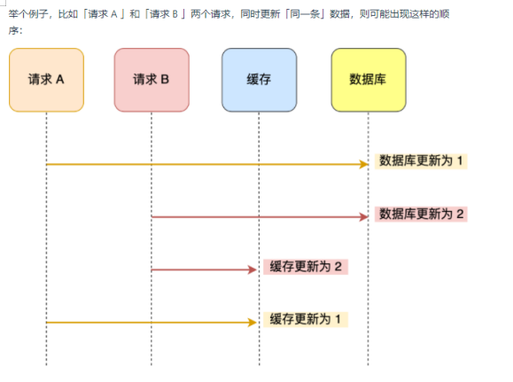

**所以我们的解决办法是操作数据库和删除缓存！**

所以应该具体先删除缓存还是操作数据库？

**答案：我们应当是先操作数据库，再删除缓存**，

**原因在于：如果你选择先删缓存，在操作数据库，在两个线程并发来访问时，假设线程1先来，他先把缓存删了，此时线程2过来，他查询缓存数据并不存在，此时他写入缓存，当他写入缓存后，线程1再执行更新动作时，实际上写入的就是旧的数据，新的数据被旧数据覆盖了。**

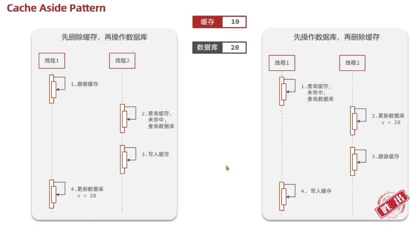

**所以我们项目使用的方案是：先操作数据库，然后删除缓存**

**如果遇到并发量很大的情况，必须先往缓存里面插数据，这种情况怎么办？**

**解决办法：操作者只去操作缓存，由其他线程异步的将缓存数据持久化到数据库（消息队列），保证最终一致性。**

# Redis分布式锁的原理

1. **⾸先利⽤setnx来保证：如果key不存在才能获取到锁，如果key存在，则获取不到锁** 
2. **然后还要利⽤lua脚本来保证多个redis操作的原⼦性** 
3. **同时还要考虑到锁过期，所以需要额外的⼀个看⻔狗定时任务来监听锁是否需要续约** 
4. 同时还要考虑到redis节点挂掉后的情况，所以需要采⽤红锁的⽅式来同时向N/2+1个节点申请锁， 

都申请到了才证明获取锁成功，这样就算其中某个redis节点挂掉了，锁也不能被其他客户端获取到 

# Redis集群

## 主从复制

## 哨兵机制

# Redis的五种数据类型以及底层的数据结构

## 概述

## **全局 hash 表** 

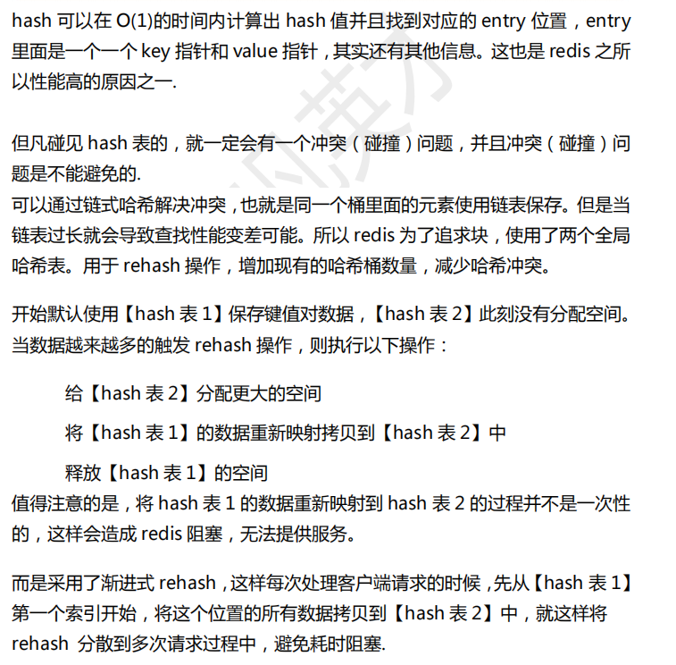

## RedisObject

**Redis中的任意数据类型的键和值都会被封装为一个RedisObject，也叫做Redis对象**

**什么是redisObject？**
从Redis的使用者的角度来看，⼀个Redis节点包含多个database（非cluster模式下默认是16个，cluster模式下只能是1个），**而一个database维护了从key到value的映射关系。这个映射关系的key是string类型，⽽value可以是多种数据类型，比如：string, list, hash、set、sorted set等**。我们可以看到，**key的类型固定是string，而value可能的类型是多个。**

**从Redis内部实现的⾓度来看，database内的这个映射关系是用⼀个dict来维护的**。**dict的key固定用⼀种数据结构来表达就够了，这就是动态字符串sds，而value则比较复杂。为了在同⼀个dict内能够存储不同类型的value，这就需要⼀个通⽤的数据结构，这个通用的数据结构就是redisObject。**

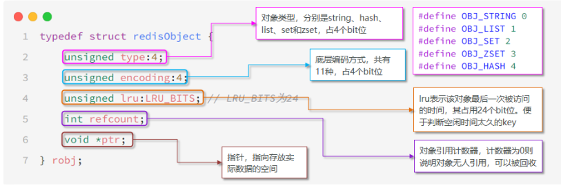

## Dict

**我们知道Redis是一个键值型（Key-Value Pair）的数据库，我们可以根据键实现快速的增删改查。而键与值的映射关系正是通过Dict来实现的。**

**Dict由三部分组成，分别是：哈希表（DictHashTable）、哈希节点（DictEntry）、字典（Dict）**

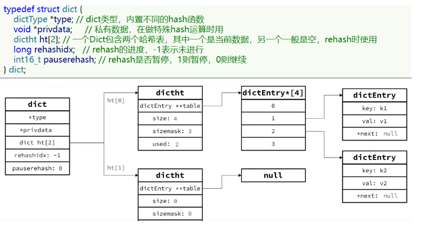

**Dict的结构：**

- **类似java的HashTable，底层是数组加链表来解决哈希冲突**
- **Dict包含两个哈希表，ht[0]平常用，ht[1]用来rehash**

## String（简单动态字符串）

**String是Redis中最常见的数据存储类型，基于简单动态字符串（SDS）实现。**

**Redis是C语言实现的，其中简单动态字符串（SDS）是一个结构体，源码如下：**

**优点：**

**1.获取字符串长度的时间复杂度为O（1）**

**2.支持动态扩容**

**String在Redis中是⽤⼀个redisObject来表示的，其中ptr指针指向了SDS的地址。用来表示String的redisObject可能编码成3种内部表示：RAW，EMBSTR，INT。**

**1.其基本编码方式是RAW，如果存储的SDS长度小于44字节，则会采用EMBSTR编码**

**2.EMBSTR编码，此时redisObject与SDS是一段连续空间。申请内存时只需要调用一次内存分配函数，效率更高。**

**3.果存储的字符串是整数值，并且大小在LONG_MAX范围内，则会采用INT编码：直接将数据保存在RedisObject的ptr指针位置（刚好8字节），减少内存的使用，不再需要SDS了，**

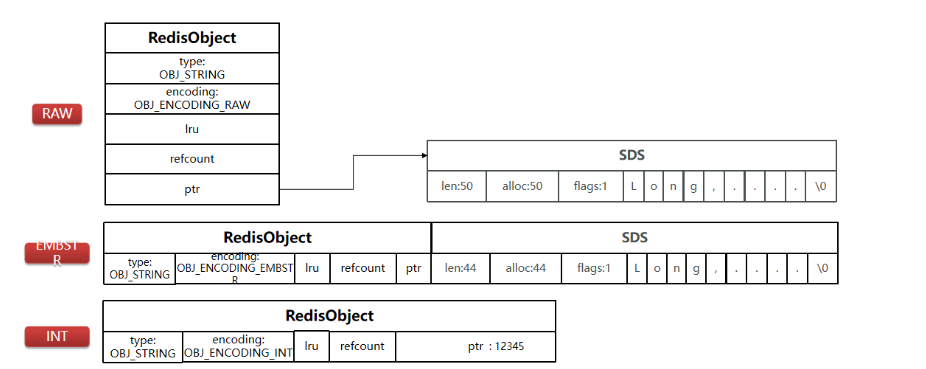

## List（QuickList（LinkedList + ZipList））

**Redis的List类型可以从首、尾操作列表中的元素。Redis的List结构类似一个双端链表，可以从首、尾操作列表中的元素：**

**哪一个数据结构能满足上述特征？**

- **LinkedList ：普通链表，可以从双端访问，内存占用较高，内存碎片较多**
- **ZipList ：压缩列表，可以从双端访问，内存占用低，存储上限低**
- **QuickList：LinkedList + ZipList，可以从双端访问，内存占用较低，包含多个ZipList，存储上限高**

**ZipList 是一种特殊的“双端链表” ，由一系列特殊编码的连续内存块组成**。可以在任意一端进行压入/弹出操作, 并且该操作的时间复杂度为 O(1)。

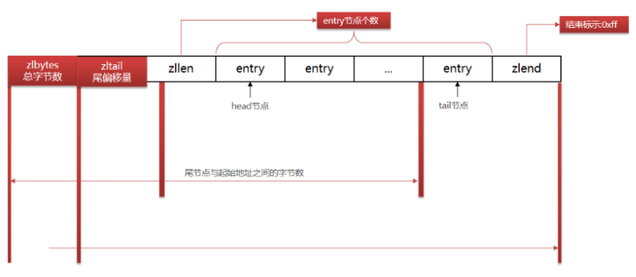

**ZipList特性：**

**1.压缩列表可以看做一种连续内存空间的"双向链表"**

**2.列表的节点之间不是通过指针连接，而是记录上一节点和本节点长度来寻址，内存占用较低**

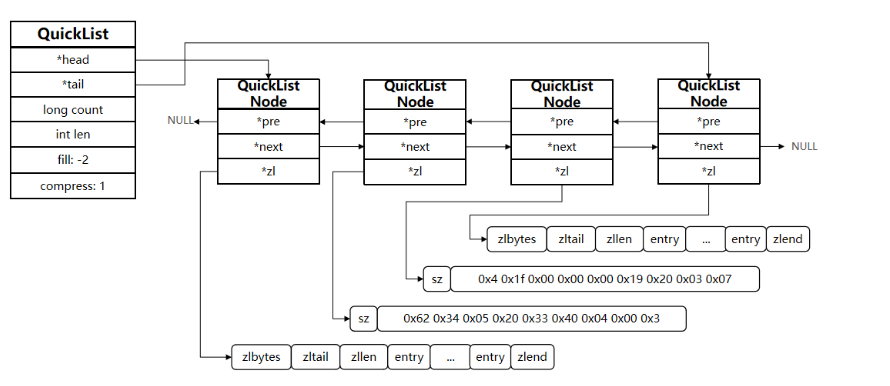

**QuickList的特点：**

- **是一个节点为ZipList的双端链表**
- **节点采用ZipList，解决了传统链表的内存占用问题**
- 控制了ZipList大小，解决连续内存空间申请效率问题
- 中间节点可以压缩，进一步节省了内存

**在3.2版本之前，Redis采用ZipList和LinkedList来实现List**，当元素数量小于512并且元素大小小于64字节时采用ZipList编码，超过则采用LinkedList编码。

**在3.2版本之后，Redis统一采用QuickList来实现List**

## Set（Dict）

**Set是Redis中的单列集合，满足下列特点：**

- **不保证有序性**
- **保证元素唯一**
- **求交集、并集、差集**

**所以：Set是Redis中的集合，不一定确保元素有序，可以满足元素唯一、查询效率要求极高。**

**可以看出，，思考一下，什么样的数据结构可以满足？**
**HashTable，也就是Redis中的Dict，不过Dict是双列集合（可以存键、值对），为了查询效率和唯一性，set采用HT编码（Dict）。Dict中的key用来存储元素，value统一为null。**

**当存储的所有数据都是整数，并且元素数量不超过set-max-intset-entries时，Set会采用IntSet编码，以节省内存**

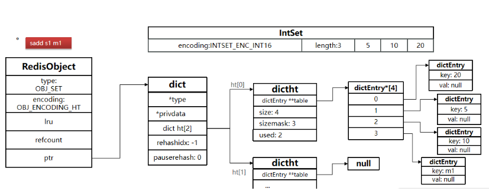

## ZSet（SkipList+Dict）

**ZSet也就是SortedSet，其中每一个元素都需要指定一个score值和member值**：

- 可以根据score值排序后
- **member必须唯一**
- **可以根据member查询分数**

**因此，zset底层数据结构必须满足键值存储、键必须唯一、可排序这几个需求。之前学习的哪种编码结构可以满足？**

- **SkipList：可以排序，并且可以同时存储score和ele值（member）**
- **Dict：可以键值存储，并且可以根据key找value**

**SkipList（跳表）首先是链表，但与传统链表相比有几点差异：**

**1.元素按照升序排列存储        2.节点可能包含多个指针，指针跨度不同。**

**zset底层数据结构:**

**当元素数量不多时，HT和SkipList的优势不明显，而且更耗内存。因此zset还会采用ZipList结构来节省内存，不过需要同时满足两个条件：**

- **元素数量**小于zset_max_ziplist_entries，默认值128
- **每个元素都小于zset_max_ziplist_value字节**，默认值64

## Hash（ZipList或者Dict）

Hash结构与Redis中的Zset非常类似：

- 都是键值存储
- 都需求根据键获取值
- 键必须唯一

区别如下：

- **zset的键是member，值是score；hash的键和值都是任意值**

- **zset要根据score排序；hash则无需排序**

  

**Hash结构默认采用ZipList编码，用以节省内存。 ZipList中相邻的两个entry 分别保存field和value**

**当数据量较大时，Hash结构会转为HT编码，也就是Dict**

# Redis分布式锁

分布式锁是一种多进程、多机器结点之间的一种互斥锁，保证多个进程或多个机器节点对于共享资源访问的排他性

- 线程锁的生命周期是单进程，多线程

- 分布式锁的生命周期是多进程，多机器节点

- 线程锁和分布式锁都具有

  **排他性**(同一时间只能有一个线程/进程/节点访问共享资源)

  **可重入性**(已经获得锁的线程/节点 可以再次获取锁)

  锁释放、锁获取

  锁失效机制：避免死锁

Redis中的SETNX命令可以实现锁的排他性，当key存在的时候返回0，不存在的时候返回1

使用expire命令 设置锁的失效时间，避免死锁问题

业务逻辑没有执行完，锁就过期了，这时写一个定时任务，对指定的Key进行续期

Redisson开源组件提供了分布式锁的封装实现，内置了一个Watch Dog(看门狗)的机制对Key做续期

如果redis搭建了高可用集群，出现了主从切换导致key失效的问题，也可能导致多个线程或进程抢占同一个锁资源的情况，提供了RedLock的解决办法

可以使用zookeeper或 etcp

zookeeper使用了zab协议保证了数据一致性

etcp使用raft算法保证数据一致性

在锁互斥方面

zookeeper可以基于有序节点，结合Watch机制；etcp可以基于prefix和Watch机制来实现互斥和唤醒

