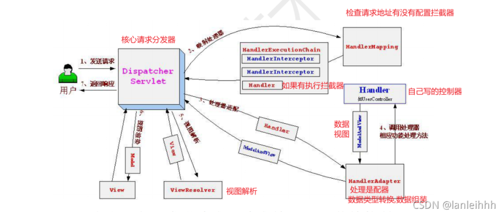
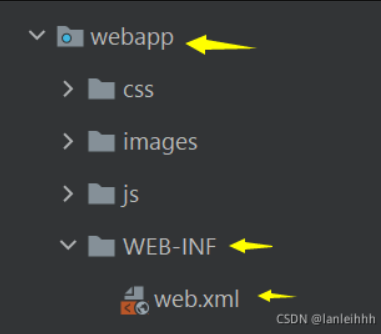

# springMVC(1、概述&搭建&接收请求).md

## 一、springMVC

### 概述

- springMVC是spring框架中的一个模块,而不是一个单独的框架
- 是一个基于MVC的web框架,方便前后端传输数据
- 拥有控制器(**Contorller**),接收请求,解析参数,传给服务层(**Service**)

### 运行流程



### 组件

- **DispatcherServlet**:继承自**HttpServlet**,是springMVC中的前端控制器(Front Controller)

  


- **HandlerMapping**:DispatcherServlet自己不处理请求,交给页面控制器,**HandlerMapping**负责选择正确的页面控制器,经HandlerMapping处理之后,DispatcherServlet就知道将请求交给哪一个页面控制器了

- **HandlerAdapter**:HandlerMapping处理之后,DispatcherServlet获得了(多个)处理器,为了方便调用,DispatcherServlet将处理器包装为HandlerAdapter处理器适配器,HandlerAdapter调用处理器的处理方法,返回一个ModelAndView对象

  

## 二、springMVC的搭建

### 0.写spring与mybaits中的配置


### 1.导入springMVC的jar包

```xml
<dependency>
    <groupId>org.springframework</groupId>
    <artifactId>spring-webmvc</artifactId>
    <version>5.2.2.RELEASE</version>
</dependency>
```

### 2.配置**DispatcherServlet**

在webapp/WEB-INF/web.xml中配置DispatcherServlet




```xml
	<!--springMVC提供了的一个对servlet进行封装的请求分发servlet-->
    <servlet>
        <servlet-name>dispatcherServlet</servlet-name>
        <servlet-class>org.springframework.web.servlet.DispatcherServlet</servlet-class>
        <!--配置初始化参数:参数为spring的配置文件-->
        <init-param>
            <param-name>contextConfigLocation</param-name>
            <param-value>classpath:spring.xml</param-value>
        </init-param>
        <load-on-startup>0</load-on-startup><!--0:服务器启动就创建servlet对象-->
    </servlet>

    <servlet-mapping>
        <servlet-name>dispatcherServlet</servlet-name>
        <url-pattern>/</url-pattern>
        <!-- / :所有请求都会进入到DispatcherServlet中,不想进入的使用静态资源过滤器-->
    </servlet-mapping>
```

其中的classpath:spring.xml

 


### 3.开启springMVC注解

创建一个专门配置springMVC的配置文件

```xml
<?xml version="1.0" encoding="UTF-8"?>
<beans xmlns="http://www.springframework.org/schema/beans"
       xmlns:xsi="http://www.w3.org/2001/XMLSchema-instance"
       xmlns:context="http://www.springframework.org/schema/context"
       xmlns:aop="http://www.springframework.org/schema/aop"
       xmlns:tx="http://www.springframework.org/schema/tx"
       xmlns:mvc="http://www.springframework.org/schema/mvc"
       xsi:schemaLocation="http://www.springframework.org/schema/beans
       https://www.springframework.org/schema/beans/spring-beans.xsd
       http://www.springframework.org/schema/context
       http://www.springframework.org/schema/context/spring-context.xsd
       http://www.springframework.org/schema/aop
       http://www.springframework.org/schema/aop/spring-aop.xsd
       http://www.springframework.org/schema/tx
       http://www.springframework.org/schema/tx/spring-tx.xsd
       http://www.springframework.org/schema/mvc
       http://www.springframework.org/schema/mvc/spring-mvc.xsd">

    <!--开启springMVC注解-->
    <mvc:annotation-driven></mvc:annotation-driven>
    
</beans>
```

注意:需要在spring配置中加入注解扫描

```xml
<!--开启spring注解扫描
    base-package:指定包下所有类是否有注解标签-->
    <context:component-scan base-package="com.ffyc.ssm"></context:component-scan>
```


### 4.控制器类搭建

- @**Controller**

  用于标记在控制层的类上,使用@Controller标记的类就是springMVC中的Controller对象

  spring 配置中指定了自动扫描的 basepackage 后，spring 会扫描这些包以及子包中使用了@Controller 标识的类，然后将类加入到 SpringIOC 容器中,交由spring管理,注入依赖。

- @**RequestMapping**

  用来处理请求地址映射的注解,可用于类或方法上(@RequestMapping(path= "/admin"))

  后端

  ```java
  package com.ffyc.ssm.controller;
  
  import com.ffyc.ssm.service.AdminService;
  import org.apache.ibatis.annotations.Param;
  import org.springframework.beans.factory.annotation.Autowired;
  import org.springframework.stereotype.Controller;
  import org.springframework.web.bind.annotation.RequestMapping;
  import org.springframework.web.bind.annotation.RequestMethod;
  
  @Controller//控制层的类
  @RequestMapping(value = "/adminTest")
  public class AdminController_back {
  
      @Autowired//自动注入属性
      AdminService service;
      
      //RequestMapping 为方法提供一个映射地址,一个类或方法可以匹配多个映射地址
      @RequestMapping(path = {"/test1","/test2"},method = RequestMethod.GET)
      public void test(){
          System.out.println("访问了控制层");
      }
  }
  ```

## 三、接收请求

### @RequestMapping

- @**RequestMapping**

  用来处理请求地址映射的注解,可用于类或方法上(@RequestMapping(path= "/admin"))

  匹配前端的请求路径,匹配上后,被@RequestMapping标记的方法会执行

  - **value**:请求的路径,类型是一个 String[] ,即可以匹配多个请求路径
    - @RequestMapping(**path ="/test1"**)
    - @RequestMapping(**path = {"/test1","/test2"}**)
  - **path**:与value作用相同
  - 

  - **method**:Http请求的类型:post/get;
    - @RequestMapping(path ="/test1",**method = RequestMethod.GET**)
    - @RequestMapping(path ="/test1",**method = RequestMethod.POST**)
    - 可以使用@**RequestMapping**(path="test1",method="RequestMethod.POST"),可以使用**@GetMapping**(value="test1"),或**@PostMapping**(value="test1")
    - 若不注明请求方式,则get请求/post请求都可以进入


前端

```html
<!--超链接为get请求-->
<a href="adminTest/test1">aaaaaa</a>
```

@RequestMapping标记了的test()方法匹配到了前端超链接的请求地址adminTest/test1,调用test()方法

### 获取请求数据

我们编写处理器方法的目的，就是为了处理客户端提交的数据，而客户端的提交是按照 HTTP 协议报文格式来提交的，下面我们分析一段常见的 HTTP POST 提交的报文来理解报文的各个部分与处理器方法参数的对应关系

- 请求**方法**：对应到@RequestMapping 中的 **method** 
- 请求 **URI** "/admin/test" 对应到@RequestMapping 中的 **value** 或者 **path** 
- **请求头**:比如获取 ==User-Agent== 中的值则使用**@RequestHeader**("==User-Agent==")来获取 
- **请求参数**：比如获取 ==name== 参数的值，则使用**@RequestParam**("==name==")来获取

前端

```html
<a href="adminTest/test1?id=1&name='张三'">aaaaaa</a>
```


#### 使用@RequestParam绑定参数(前后端参数名不一致)

```java
	//前后端参数不一致时,使用@RequestParam绑定参数
    @RequestMapping(path = "/test1",method = RequestMethod.GET)
    public void test(@RequestParam("id")int adminId,@RequestParam("name")String account){
        System.out.println(adminId);//1
        System.out.println(account);//'张三'
    }
```


#### 请求参数名与处理器方法参数名相同时,不写@RequestParam

```java
	@RequestMapping(path = "/test1",method = RequestMethod.GET)
    public void test(Integer id,String name){
        System.out.println(id);//1
        System.out.println(name);//'张三'
    }
```


#### 通过HttpServletRequest对象获取

```java
 //springMVC可以将HttpServletRequest request,HttpServletResponse 直接注入到我们方法中
    @RequestMapping(path = "/test1",method = RequestMethod.GET)
    public void test(HttpServletRequest request, HttpServletResponse response){
        System.out.println(request.getParameter("id"));//1
        System.out.println(request.getParameter("name"));//'张三'
    }
```


#### 参数绑定与类型转换(Date)

​		如果请求**参数比较多**，通常是将这些参数**放到**一个**实体**中，然后只需要在处理器方法上定义这个**实体作为参数**。HandlerAdapter 会将这个对象的实例创建出来，然后从请求参数中取出这些参数然后放到实体对象中，需要注意的是请求**参数的名字需要与实体类中的属性一一对应**，只有对应的属性才会提取参数的值

```html
<form id="formId"  method="post" action="adminTest/test2">
    <input type="text" name="id">
    <input type="text" name="account">
    <input type="text" name="birthday">
    <input type="submit" value="提交">
</form>
```

```java
@RequestMapping(path = "/test2",method = RequestMethod.POST)
public void test(Admin admin){
    System.out.println(admin.getId());
    System.out.println(admin.getAccount());
    System.out.println(admin.getBirthday());
}
```


报错了


无法将前端接收的字符串转为日期类,我们在Date对象上**添加@DateTimeFormat**标签,指定Date类型的格式

```java
 	//@DateTimeFormat(pattern = "YYYY-MM-dd")
 	private Date birthday;//日期类属性
```

现在运行,可以接收到了


注意:若**输入格式与指定格式不匹配,服务器端会返回404**

类似的格式化注解标签还有  **@NumberFormat** ,用于格式化数字


